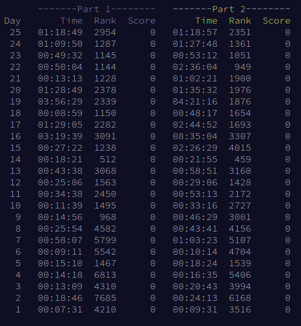
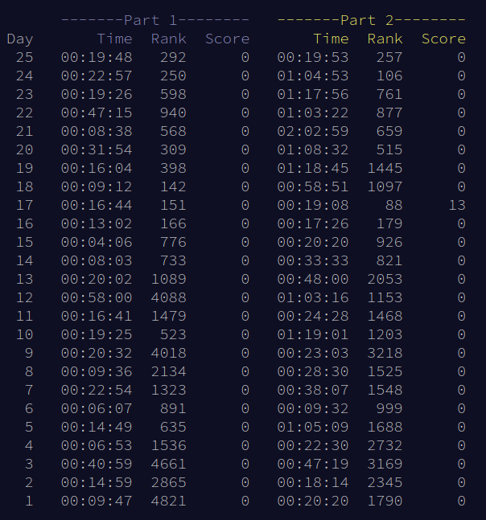
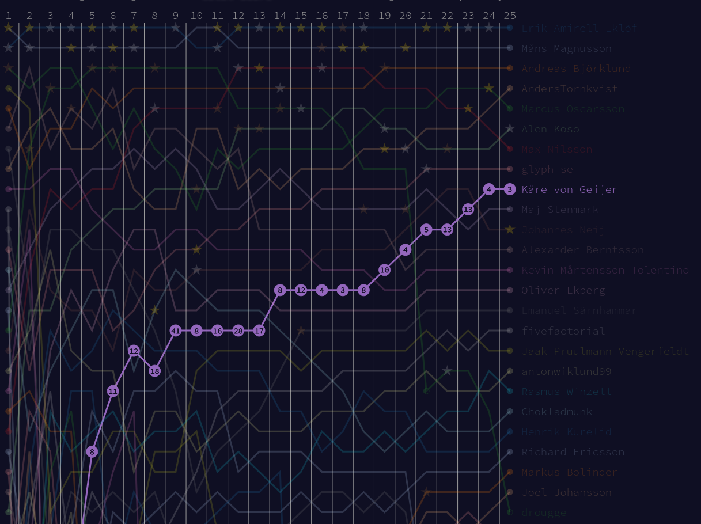

+++
title="Advent of Code Retrospective"
date=2024-01-13

[taxonomies]
categories = ["Blog"]
tags = ["zote", "advent of code"]

[extra]
toc = true
+++


This was my fourth year doing Advent of Code, my second year trying to compete, and my first year appearing on the top 100 leaderboard (if only for a single day). Last year lit a fire in me to become faster, and since then I have built my programming language [Zote](https://github.com/KvGeijer/zote), practiced some competitive programming, and [learned to touch type using Colemak](@/blog/switching-to-colemak/index.md). This will be a short retrospective on this year's event, as well as my preparation leading up to it.

<!-- more -->

# What is Advent of Code?

<!-- TODO: Shorten this section. Most people know what it is -->

Each December, when the darkness is taking over and the nights are getting longer, I find solace in [Advent of Code](https://adventofcode.com/). It is an advent calendar with a *small* programming puzzle (split into two parts) each day between December 1st and Christmas Day. Every participant gets the same problem, but a personalized input. In this way, you can solve the problem any way you want, as long as you submit your correct answer through the website.

If you have never participated in the event before, I recommend trying the problems in your own time, and take the opportunity to practice a new language or technique. For example, I've done previous years in Haskell/Python ([2020](https://github.com/KvGeijer/Advent_of_Code_2020)), Rust ([2021](https://github.com/KvGeijer/Advent_of_Rust)), Julia ([2022](https://github.com/KvGeijer/Advent-of-Julia)) and [Zote](https://github.com/KvGeijer/zote) ([2023](https://github.com/KvGeijer/advent-of-zote-2023)). For the best experience, you should also have some friends to discuss the problems with (and your unavoidable bugs).

Finally, there is also an optional competitive aspect to it where people compete to solve each puzzle (released 6 AM CET) as quickly as possible. You can sign up to private leaderboards to compete with friends, and if you ever get top 100 on a problem, you get points on the [global leaderboard](https://adventofcode.com/2023/leaderboard). To illustrate it, here are my stats from 2022, showing how fast I solved each puzzle and what global rank I got 



# Personal Goal for 2023

This year I wanted to go _fast_. I once again signed up for the competition hosted by [Axis](https://lifeat.axis.com/advent-of-code/) as a way to get motivated, and hopefully win something at the end. Last year I ended up in 16th place and won a Philips smart light. This year I saw that some additional speedy players had joined, so I knew it would be even harder. My goal was to get top 20 (as you then get some prize), and if possible improve from last year and place top 15.

I had also spent months creating [Zote](https://github.com/KvGeijer/zote), and I wanted to solve all days using it. I was a bit uncertain if it would be good enough to solve the most computationally expensive days, but I was optimistic.

# Preparation

One of my best decisions was forcing myself to learn how to touch type. I did this by switching to the Colemak layout which I now enjoy. You can read more [in this blog post](@/blog/switching-to-colemak/index.md), but the main advantage is that typing now requires less focus. Thus, it allows me to spend more of my energy thinking about _what_ to write, which has been fantastic.

Then I of course also had to design and implement an interpreter for [Zote](https://github.com/KvGeijer/zote). I had my first working implementation in early August, with which I managed to solve all AoC days from 2022. At that point, I had ironed out most of the design, but it was a very naive implementation. After a subsequent short break, I came back in October and November to implement a more intricate virtual machine, similar to the one of Python. However, I barely finished it in time, and there were still some bugs during the first days. It was also a bit slower than I had expected, which I just had to accept. I would love to write more about this process, but that will have to be another post.

In the autumn I also started going to the [Chalmers Coding Club](https://chalmerscoding.club/), which is a small society for competitive programming at my university. They have nice weekly meetups where I learned some new algorithms. I even participated in my first real competitive programming contest [NCPC 2023](https://ncpc23.kattis.com/contests/ncpc23/standings) and managed to solve a few fun problems with two lovely teammates. This helped a bit, but I must admit I spend most of my free time on Zote...

# Advent of Code 2023

So, how was this year and how did it go for me? Overall, I am happy to say that it was a good year for me. It started of a bit shaky with some relatively slow days, but I really seemed to excel in the latter half with a bit harder problems. Here are my personal stats for this year, which you can see have a lot better rankings than last year:



I think it is rather amusing that I solved day 17 faster than day 1...

I also did well in the Axis competition, and ended up in 9th place! It was a really rocky start, but I climbed steadily as you can see below (although I think the days might be misaligned by 1):



## This years puzzles

I felt that this year started out very hard. To this date, a quarter of the people (70 000) who solved day one part one, did not complete part 2 (last year only 15 000 abandoned before part 2). It continued with a few relatively trickly days in the first week, which I think was a bit cruel to the first-timers.

However, a lot of puzzles in the middle were not that hard, which balanced out the first week a bit. Finally, the last week picked up the difficulty, giving us some of the trickiest problems on days 24 and 25 (which was a bit mean).

Overall I think it was a good year for intermediates and above. I was really happy that there were not that many later days with brute force iteration over grids, or similar brute force search tasks which would have been annoying in Zote.

### Day 5
This was the first tricky one, and quite cruel for being this early. The input contained a sequence of mapping stages, which each linearly mapped some range of inputs to corresponding ranges (just a constant offset mapping). For part 2 you got a few huge input ranges and got asked to find the value in these ranges which would be the smallest after feeding it through all mapping stages.

To solve this you had to concisely represent each range of numbers as two numbers (the start and end value). These ranges were then split and transformed in stages depending on their overlaps with the various mapping stages. It is not super hard, but a bit finicky to get working (and I was not 100% sure it would not blow up with exponentially many ranges).

You could also search through the output domain, by working backward for every value (0..) and find the first one which could be mapped from an input range. I implemented this initially, but it was essentially only feasible in a compiled language.

### Day 10
This was one of my favorite problems ever! You got a path on a grid and were tasked with finding the area this route surrounded. However, their definition of 'surrounded' is the mathematical one, which makes it a bit tricky. For example, cases such as below could appear, where `O` is outside path and `I` is inside:
```
OOOOOOOOOO
O┏━━━━━━┓O
O┃┏━━━━┓┃O
O┃┃OOOO┃┃O
O┃┃OOOO┃┃O
O┃┗━┓┏━┛┃O
O┃II┃┃II┃O
O┗━━┛┗━━┛O
OOOOOOOOOO
```

There were many cool solutions for this. Mine was to traverse the path, finding all indexes to the right and left respectively of the path. Then I did a flood-fill in all indexes to the right, and if none reached the edge, I knew that those areas were the inside. Otherwise, I did the same to the left which must be the inside area.

A nice solution I saw was from the field of graphics. You iterate over all characters in each line at a time, keeping track of how many vertical path segments `|` you have crossed. If you encounter an empty cell and the vertical count is odd, you must be inside the enclosure, so you increment some global count. Do this for all lines, and you are done. Such a simple and cool solution!

### Day 18

This was another fun day, and it was essentially the same underlying problem as above, but with some different conditions. It did not have tricky paths as above, and a flood fill worked on part 1. However, part 2 blew up the size, and made it impossible to iterate over each contained cell, making it much harder.

If we had not had day 10, I would have been completely lost here. But I heard a lot of people talk about some [shoelace formula](https://en.wikipedia.org/wiki/Shoelace_formula) for day 10, which supposedly was some mathematical way of solving it very easily. After a quick web search, it turned out to be a cool formula for finding the area of a simple polygon. Then the only tricky part was that this only counted the area inside, but we wanted all cells touching the inside (basically the edge cells to be included). For this, you could use [Pick's Theorem](https://en.wikipedia.org/wiki/Pick%27s_theorem), but I did not fully understand how, so instead reasoned about how much of the border was missing from the picks result.

This was an enjoyable way for me to find out about a neat new algorithm/formula. It makes sense that the area of a simple polygon is easily computable, but I had never needed this before. The shoelace formula just does it by iterating over each corner once, adding and subtracting some stuff from a sum.

### Day 8, 14, 20, 21

These all in some way required you to find some repeating pattern(s) and extrapolate them far into the future (as doing a naive simulation would be far too slow). I was surprised that there were this many this year, but they all had different patterns, types of patterns, and questions, so they did not feel repetitive to me.

I fought the most with day 21, which presented a 2D grid-based map (with obstacles) and asked you how many tiles you could visit after _N_ steps. Part 2 then blew up the number of steps, and said that the map repeated endlessly in all directions, making it a problem of a bfs on an infinite graph. The key insight was that the specific input lead to a pattern showing up in the number of visited cells if you only looked every SIZE steps, where SIZE was (basically) the size of the map. This makes sense as we are almost looking for the area of a ~square where one side grows linearly (area will grow quadratically with some periodicity). I found this hard, but really fun once I got it.

### Day 24

Oh what a lovely present. We got an input of many hail stones with positions and velocities, and were tasked with throwing a rock to collide with them all. It was a cool problem, but also very hard as you ended up with a non-linear equation system, and had to do some smart substitutions to linearize and solve it.

However, me and many others solved it with the [Z3 solver](https://github.com/Z3Prover/z3), which is originally a theorem prover. You can feed it a bunch of constraints, like our equations, and it will try to find the answer for you (very quickly) with some magic SAT solver algorithm. I had only heard of it before, so it was fun to try it (albeit under time pressure), and I even almost got top 100.

## Using Zote

Zote worked out better than I could reasonably have hoped for. It was a bit slow, and I had several days where my runtime was several minutes (both down to brute-forcey implementations, and a slow language), but there were few times it prevented a reasonable solution from being viable.

However, it did have some issues. For example, I had to revert back to my old naive implementation for an early day, as my new one did not support sorting with a custom comparator function. I later solved this by defining a lexicographical ordering on lists, which sort of enables a custom sort (if I want to sort by `f`, I can just map items to `[f(item), item]` and sort those). But this was the only real issue.

Then I had one day where I ran into the recursion and stack limit. This was quite easy to fix on the fly by changing some variables in the Zote code and recompiling it. But it taught me that it would be nice to increase those sizes as cli arguments (after compilation).

One thing which would be nice was a memoize decorator. I knew this would be a nice thing to have, but did just not have time to implement it. One this is that I am unsure of how I want the syntax, as well as how it should be implemented (can/should it be done without an extra call frame?).

# Final remarks

This was a great year for me, and I am happy with my results. It also got a nice ending, with me being invited to [Episode 564](https://kodsnack.se/564/) of the Swedish programming podcast  [Kodsnack](https://kodsnack.se/), which was hugely exciting. They also have a lovely channel on Slack where people discussed the problems. These discussions makes it way more fun, and I even convinced quite a few in the office to join the event which was great as well!

For next year, I will make sure to practice a bit more for the earlier days (if I want to compete again). Additionally, I hope I have had time to work a bit more on Zote, making it feel like a partly different language (or just move on to a new one). This was a great time, and I am already looking forward to biking through the sleeping city next December.


