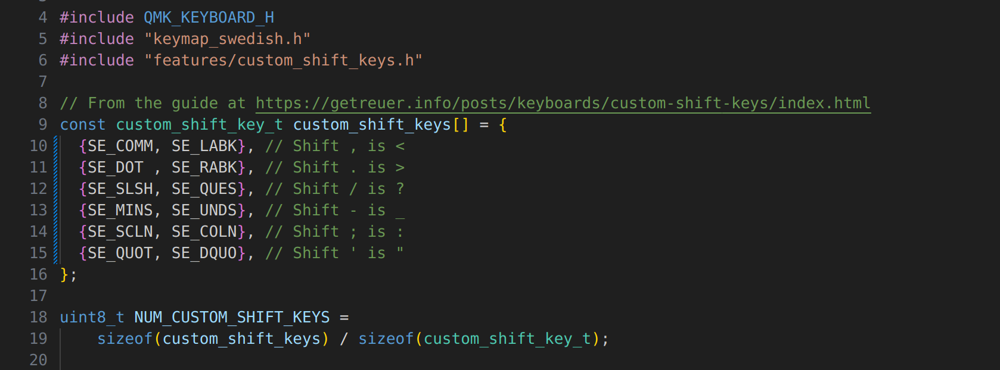

+++
title="Building a Custom Keyboard "
date=2024-09-24

[taxonomies]
categories = ["Project"]
tags = ["keyboard"]

[extra]
toc = true
+++

Almost two years ago, I listened to a [podcast episode](https://kodsnack.se/490/) about custom keyboard layouts, such as [Colemak](https://en.wikipedia.org/wiki/Colemak), and building a custom keyboard with only 22 keys. It hit me at just the right time, and caused me to shortly afterward switch to Colemak (which I've happily been using since then, and wrote a post about [here](@/blog/switching-to-colemak/index.md)). Since then, I have been meaning to also build my own custom keyboard, and now I finally finished! This is a short recap on how I went about building the keyboard, as well as I configured it.

<!-- more -->

# Selecting the Keyboard

For some reason, I really wanted to have a split keyboard, and spend some time looking for a good alternative. I was close to buying the pre-built [ZSA Moonlander](https://www.zsa.io/moonlander), but ultimately thought it was a bit too expensive. I also had some interest in doing some more hands on projects, and therefore decided to solder a keyboard myself. There are many good open source [split keyboards](https://github.com/diimdeep/awesome-split-keyboards) to chose from, and in the end I chose the [Corne](https://github.com/foostan/crkbd/), as it is rather popular and I was interested in such a small keyboard with only 42 keys.


As its Github page contains the CAD files for the PCBs required, as well as a build guide with all other required components, it is not that hard to to buy all the components yourself. However, it became a bit cumbersome, as I would need to buy them from different retailers (essentially all abroad). Instead, as the Corne is quite popular, I was able to buy a [kit from the UK](https://mechboards.co.uk/products/helidox-corne-kit) with all the parts, excluding the switches and keycaps, for quite a reasonable price.

I had a quite hard time selecting which switches to use. As Cherry seemed to be standard, I decided to go for them, and after trying some different ones, and watching some videos, I settled on the very common red switches. This felt as a good first choice, which I could later change if I wanted something more exotic.

Furthermore, it took me a while to select the keycaps. To be honest, I did not even buy them until after I had assembled everything else. But in the end I settled on a couple of transparent dark blue ones, as I thought it would be nice to not block all of the LEDs. I think this ended up really nice, and recommend transparent switches if you also have backlight LEDs.

# Building the Keyboard

To build the keyboard, you have to do a lot of soldering, and I don't have a soldering iron (nor had any idea about these kinds of things). Therefore, I was very fortunate to get some help from, and use the equipment of, my dear friend [Erik](https://www.linkedin.com/in/erik-almbratt-624609109/?originalSubdomain=se). He had a sharp soldering iron tip, and some nice tweezers, which proved very useful for the detailed soldering.

There are several build guides for the Corne, and the [official one](https://github.com/foostan/crkbd/blob/main/docs/corne-cherry/v3/buildguide_en.md) is a good starting point. Essentially, the soldering consists of soldering the following pieces onto the PCB:
- 42 diodes (82 joints),
- 42 backlight LEDs (168 joints),
- 12 underglow LEDs (48 joints),
- TRRS jacks, reset switches, and OLED pin sockets (20 joints),
- 2 Micro controllers (96 joints),
- 2 OLED modules (8 joints),
- 42 switch sockets (82 joints),

which totals up to above 500 soldering joints. This felt a bit overwhelming initially, as it was my first time soldering. Furthermore, many of the joints were close together, making me fear creating bridges. However, after some guidance and practice, it quickly became routine and rather simple.


After that, you just had to screw some of the different parts together, and insert the switches. This is quite simple if you do it right and follow the build guide, and just make sure to be a bit gentle when inserting the switches.


Then you just have to put on the keycaps, and you are done! If you did everything correctly that is. Two of my joints broke (or were never properly soldered), so I had to remake them, but it was rather simple. You can see the finished product below (with firmware to turn on the LEDs)!


# Setting up the Firmware

To actually be able to use the keyboard, you need to set up its firmware. This is done by first obtaining a compiled version of the firmware on your computer, and then flashing it to both halves of the keyboard. There are different eco systems for this part, but the most common one, which I currently use, seems to be [QMK](https://qmk.fm/). If you are on Windows or Mac, the [QMK Toolbox](https://qmk.fm/toolbox) is a nice GUI which you can use for flashing the firmware. If you are on Linux, or like the command line, you should use [QMK Firmware](https://qmk.fm/) for flashing.

Before flashing your firmware, you need to decide which one to use, which includes choosing how the keys are laid out. There are many different layouts to choose from online, and QMK includes default layouts for a large variety of keyboards. If using QMK Firmware, the first step is to compile it, which you can do as below for Corne.

``` sh
qmk compile -kb crkbd/rev1 -km default
```

Then, you just have to flash the compiled firmware onto the keyboard. For the Corne, this is done by connecting one of the splits to the computer, running `qmk flash -kb crkbd/rev1 -km default`, and hitting the physical reset switch on the keyboard split, then repeating for the other side. Now your keyboard should be up and running!

# Creating a custom Keymap

The keymap specifies what the keyboard sends to the computer every time you press a key. This is used in combination with the OS keyboard layout, which specifies how the software interprets the data received from the keyboard. For some users, it might be perfect to stick with the default keymap and layout. However, I both wanted to be able to use the Swedish characters ÅÄÖ, as well as use the Colemak layout, which I could not find for the Corne online. Furthermore, I wanted to be able to play around a bit myself with what I liked, so I decided to create my own keymap.

The simplest way to create a custom keymap with QMK is to use the online [QMK Configurator](https://config.qmk.fm), where you can configure the keymap online, and then either download it as a JSON, or compile it directly for flashing.

However, as I needed some more powerful configuration features than what was available in the web GUI, I chose to create the layout using QMK Firmware directly in C. Follow the guide [here](https://docs.qmk.fm/newbs_getting_started) for detailed instruction on how to set up your environment, potentially creating up an [external userspace](https://docs.qmk.fm/newbs_external_userspace), and then [creating your keymap](https://docs.qmk.fm/newbs_building_firmware). To create the keymap, you create a new sub-directory for your selected keyboard, for example by copying the default keymap, and then configure the `keymap.c`. You can see a sample of [my file](https://github.com/KvGeijer/qmk_keyboards/blob/main/keyboards/crkbd/keymaps/swe-colemak/keymap.c) below.

[](https://github.com/KvGeijer/qmk_keyboards/blob/main/keyboards/crkbd/keymaps/swe-colemak/keymap.c)

As you can see, the keymap mainly consists of a couple of layers, each specifying how each key press should be interpreted by using C macros. In a larger keyboard, you probably only have a single layer, but on the Corne I can't even fit the characters and the numbers on without separate layers. Therefore I have one layer mainly for normal writing, one for numbers and movement arrows, one for symbols, and one for miscellaneous thing such as LEDs and volume.

As I wanted the Swedish characters, I decided the simplest solution was to use the Swedish keyboard layout in the computer. As that layout has different placement for the symbols, you cannot use the normal key macros such as `KC_DOT`, and instead have to `#include "keymap_swedish.h"` and use custom macros such as `SE_DOT` instead. However, I still use the US/Colemak positions for symbols, so if you don't use the Swedish layout in the OS, all the symbols will be completely off.

Furthermore, as I use the Swedish OS layout, the shifted symbols are different from what I expect with the US layout. To retain the US shifted symbols, such as the shift of `.` being `>`, you can override the shifted keys in the keymap. To get this right, I used [this nice guide](https://getreuer.info/posts/keyboards/custom-shift-keys/index.html), and it mainly entails creating a couple of structs for mapping keys to their shifted ones, as seen below.

[](https://github.com/KvGeijer/qmk_keyboards/blob/main/keyboards/crkbd/keymaps/swe-colemak/keymap.c)

There are many other cool things you can do here. For example, the default Corne keymap has the layer keys in the best thumb positions. These only do something when held, so instead you can modify them to do something else when simply pressed. I am now trying out letting my left layer key output a space when just pressed, which is done by using and creating this macro:

``` c
// Space when tapped, or move to layer 1 when held
#define LT_1_SPC LT(1, KC_SPC)
```

For more keymap features, I recommend looking at the [QMK documentation](https://docs.qmk.fm/keycodes).

# Conclusions

In the end, this was a really fun project, and I can definitely see myself creating another keyboard, or further customizing this one. For example I would be interesting in adding some sort of wrist support to the keyboard. I will for sure also play around a lot with my keymap, for example finding a place for a Key lock. If you are interested in playing around with keyboards, I wholeheartedly recommend building a split one, or testing different layouts/keymaps.

