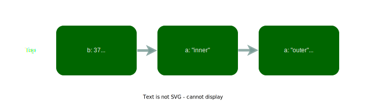

+++
title="Confounding Rust lifetimes"
date=2023-05-03

[taxonomies]
categories = ["Programming"]
tags = ["rust", "zote"]

[extra]
toc = true
+++

I don't think I will ever completely understand Rust lifetimes. Every time I think I get them, they come right back and hit me in the face. The other day I wanted to implement scoped variable bindings for my new programming language [Zote](https://github.com/KvGeijer/Zote), and it took me several hours to figure out why it did not work as I expected. So let's talk a bit about lifetimes, for both of our sakes.

<!-- more -->

# Borrow checker basics

One of the advantages of Rust is that it's an efficient language like C, but has many modern features like generics, a modern macro system, and more support for functional programming. But the main novelty of Rust is its memory safety guarantees, and that power is granted by the powerful borrow checker. Two of its most notable responsibilities are that a Rust program never dereferences a dangling pointer, and to prevent [aliasing](https://en.wikipedia.org/wiki/Aliasing_(computing)). This really impacts how we can write programs, and forces us to structure our programs in clear ways.

Rust doesn't have raw pointers (here we only talk about [safe Rust](https://doc.rust-lang.org/book/ch19-01-unsafe-rust.html), which is the majority of all Rust code) but instead we can borrow variables as either mutable or immutable. A borrow creates a reference, which is basically a pointer, but with guarantees by the borrow checker. It enforces these two rules
1. A variable can be immutably borrowed several times at once, but not while being mutably borrowed,
2. A variable can only be mutably borrowed to one place at a time.

For example, the following code is invalid, as it has a live mutable and immutable borrow to `a` at the same time.
``` rust
let a = 2;
let borrow1 = &a;     // Immutable borrow
let borrow2 = &mut a; // Mutable borrow
*borrow2 += 1;
println!("{borrow1}");
```

This, on the other hand, would be fine as the lifetimes of the borrows don't overlap. After the last use of `borrow1`, the borrow is dropped and a mutable borrow can be made.
``` rust
let mut a = 2;
let borrow1 = &a;
println!("{borrow1}");  // After this line, borrow1 is dropped
let borrow2 = &mut a;   // Mutable borrow, but borrow1 is no more
*borrow2 += 1;
println!("{borrow2}");
```

The rules of borrowing are simple, but if you have written a Rust program larger than a toy example you know the confusion even basic borrows can cause in the beginning.

## Lifetimes

When talking about borrowing and references, an important aspect is the lifetime of the referenced object, as a reference cannot outlive the original object. Without the notion of lifetimes we cannot easily guarantee references are not returned outside the scope of the referenced variable. Lifetimes in Rust are notated like generic types and are used in function signatures when a reference is returned, or in structs/enums when a reference is stored in a field. Take for example the following function which would not compile.

``` rust
fn longest(x: &str, y: &str) -> &str {
    if x.len() > y.len() {
        x
    } else {
        y
    }
}
```

Here the function signature does not specify anything about the returned reference, so the borrow checker will not know for how long the reference will be valid. By annotating the lifetimes we can guarantee to the program that the returned reference will be alive as long as the inputs are. This can then be validated during compilation and everyone will be happy. Sidenote, lifetimes must start with ```'```, and are usually named ```'a, 'b```... instead of actual names, which I find slightly dumb.

``` rust
fn longest<'a>(x: &'a str, y: &'a str) -> &'a str {
    if x.len() > y.len() {
        x
    } else {
        y
    }
}
```

For structs we must also annotate lifetimes, so that uses of the struct can annotate for how long the contained references will be alive. For example, if we want to create a stack of integers we might use the following struct using the idea of a simple singly linked list.

``` rust
struct Stack<'a> {
    value: i64,
    next: Option<&'a Stack>,
}
```

The lifetimes does not mean anything here on their own, it is just like a generic type. But when it is for example used in a function parameter, it must be attached to a real lifetime. Such as in the following function where we can borrow the top as mutable, and promise it lives for as long as the references in the stack.

``` rust
fn mutably_borrow_top_value<'a>(top: &'a mut Stack<'a>) -> &'a mut i64 {
    &mut top.value
}
```

## More lifetime resources

This was a quick introduction to lifetimes, and we will go over a bit more complicated lifetimes later in this post. But there is much to learn, and here I present some further excellent learning material if you are interested. The Rust book has a chapter [Validating References with Lifetimes](https://doc.rust-lang.org/book/ch10-03-lifetime-syntax.html) about the basics.
* Rust by example has some good ones [here](https://doc.rust-lang.org/rust-by-example/scope/lifetime.html).
* The scary Rustonomicon has a cryptic, but very important, chapter [Subtyping and Variance](https://doc.rust-lang.org/nomicon/subtyping.html) which is more theoretical.
* Then the excellent [Jon Gjengset](https://www.youtube.com/c/jongjengset) covers similar topics to the book, but in livestreams with well thought out examples and discussions. They are a bit longer to read, but if you invest the time you will certainly learn a lot.
  * His video [Crust of Rust: Lifetime Annotations](https://www.youtube.com/watch?v=rAl-9HwD858) goes over the foundational idea and use of lifetimes.
  * Then his video [Crust of Rust: Subtyping and Variance](https://www.youtube.com/watch?v=iVYWDIW71jk&t=4412s) covers the same topics as the Rustonomicon mentioned above but in a *way* more nuanced and understandable way. Additionally, it covers PhantomData at the end, which I will not even cover in this post.

# My recent failure

Let's now move on to a slightly more interesting case: my failure with local variable scopes for an interpreter. Before diving into the lifetime problem I'll quickly introduce my language and give a short introduction to how (naive) interpreters often keep track of variables. But feel free to skim through it and skip to the following sections.

## Interpreter environments

In [zote](https://github.com/KvGeijer/zote), as in most programming languages, we can assign values to variables. When thinking of how to implement this in an interpreter a natural idea is to use maps, binding variable names to their values. This works, but in programs like the following where we use [shadowing](https://en.wikipedia.org/wiki/Variable_shadowing), using a single map might not be the simplest.

``` rust
var a = "outer";
{
    print(a);
    var a = "inner";
    print(a);
};
print(a);
```

We expect this to print `outer, inner, outer`, as the inner variable shadows the outer, but is dropped when the block is closed. The intuitive way to solve this is to have a stack of maps, so that we add a new hashmap to the stack when entering a new block. This is similar to how stack frames work in natively compiled code. When a new variable is defined we add its binding to the topmost map in the stack, and when we look up a value (for using it or assigning to it) we start searching from the top map until we find a map containing the variable.



``` rust
var a = "outer";
b = 0;
{
    var a = "inner";
    b = 6;
    {
        var c = b;
        var b = 37;
        c = c + b;
        // Environment at this point shown in figure above
    }
}
```

### Problem with shadowing

This is a nice and simple way to do it, and what we will continue to look at in this post. But doesn't really hold up when we couple it with naive closures with a reference to the enclosing environment. Take this as an example.

``` rust
var a = "first";
fn print_a() {
    print(a);
};

print_a();
a = "second";
print_a();
var a = "third";
print_a();
```

What do you think should happen here? It is not very clear, but what is usually wanted is that the closure should capture the first `a` variable, so when we shadow it later (in the same scope) it should not affect the function, as we have not changed the actual variable, just shadowed it in the environment. So we should get `first, second, second`, but with my implementation, I would get `first, second, third`, as the function just has a pointer to one of the maps in the environment stack. But, that was just something I found fun, and not super relevant here...

## Naive Rust implementation

So let's now implement this stack of maps as shown in the figure above. Intuitively I would want every node in the stack to contain a hashmap and a pointer to the next node. In C this would look something like this.

``` C
struct environment {
    hash_map_t map;
    struct environment *next;
}
```

In Rust we have to think about how we borrow the next environment, and we require this borrow to be mutable as we want to be able to assign to variables defined in scopes below the current one. So something like this.

``` rust
struct Environment {
    map: HashMap<String, Value>,
    next: Option<&mut Environment>,
}
```

But now we forgot to add lifetimes, so the compiler gets confused and errors with ` expected named lifetime parameter` while pointing to the `&mut Environment` reference. So we just add one, and the compiler gets happy.

``` rust
struct Environment<'a> {
    map: HashMap<String, Value>,
    next: Option<&'a mut Environment<'a>>,
}
```

We want this to mean that the referenced `next`, and all its references lives for at least `'a`. While this is a valiant try (and would work if the reference was not mutable) it does not work. You can try playing around with adding more annotations and bounds, but in then end you will come to the same conclusion. Why it does not work is not simple, but let't put it in a context where it fails so we can try to understand. The following [code](./example-broken.rs) adds a method for defining variables and one for creating a new top in the stack, which is all we need to show the problem.

``` rust
type Value = i64;

struct Environment<'a> {
    map: HashMap<String, Value>,
    next: Option<&'a mut Environment<'a>>,
}

impl<'a> Environment<'a> {
    fn declare(&mut self, variable: String, value: Value) {
        self.map.insert(variable, value);
    }

    fn nest<'b>(&'b mut self) -> Environment<'b>
    where
        'a: 'b,
    {
        Environment {
            map: HashMap::new(),
            next: Some(self),
        }
    }
}

fn main() {
    let mut base = Environment {
        map: HashMap::new(),
        next: None,
    };

    {
        let nested = base.nest();
    }
    base.declare("x".to_string(), 13);
}
```

Before looking at the main function and the error we take look at the `nest` method. This method is used to create a new top of the stack, keeping a mutable pointer to the old top until going out of scope. We define the lifetime `'b` and say `'a: 'b`, which means that `'a` lives for at least as long as `'b`. If we had only used one lifetime `'a` we would have needed to borrow the reference to `self` for `'a`, which we don't want, so we introduce this shorter lifetime `'b` which is only how long this return value should live. Then `'b` can be shorter than its contained deeper references. I hope that sort of makes sense, otherwise maybe read it a few times and play around with similar code in the [playground](https://play.rust-lang.org).

In the main function we create an `Environment`, then add a node by calling `base.nest()` , drop that node (think that lifetime `'b` is the lifetime of `nested`), and then try to define a variable in the base. We want code like this to work (even if this example is rather useless), but instead, compilation fails with this message.

``` rust
error: lifetime may not live long enough
  --> content/blog/parser-lifetimes/example-broken.rs:19:9
   |
10 |   impl<'a> Environment<'a> {
   |        -- lifetime `'a` defined here
...
15 |       fn nest<'b>(&'b mut self) -> Environment<'b>
   |               -- lifetime `'b` defined here
...
19 | /         Environment {
20 | |             map: HashMap::new(),
21 | |             next: Some(self),
22 | |         }
   | |_________^ associated function was supposed to return data with lifetime `'a` but it is returning data with lifetime `'b`
   |
   = help: consider adding the following bound: `'b: 'a`
   = note: requirement occurs because of the type `Environment<'_>`, which makes the generic argument `'_` invariant
   = note: the struct `Environment<'a>` is invariant over the parameter `'a`
   = help: see <doc.rust-lang.org/nomicon/subtyping.html> for more information about variance

error: aborting due to previous error; 1 warning emitted
```

This error message is cryptic, but hopefully we will soon make some sense out of it. However, straight away the main issue can be seen in the notes, which is that our lifetime must be *invariant*. Next, we will try to dig a little bit into what this means.

### Invariant lifetimes

To understand what invariant lifetimes are we need to dig a bit deeper. In theory, lifetimes work as types, where the relation `'a: 'b` means that `'b` is a subtype of `'a`, or informally `'a` is at least as useful (lives for at least as long) as `'b`. As an example, the static lifetime `'static` used for values alive the whole execution, like string literals in the code, is a subtype of all other lifetimes as it will be alive for at least as long.

But we seldom talk about lifetimes on their own, instead we for example talk about references `&'a T`. Here the reference `&` is a so-called [type constructor](https://en.wikipedia.org/wiki/Type_constructor). When a type constructor is supplied with its arguments (here `'a` and `T`) it forms the type `&'a T` (so `&` is a type constructor while `&'a T` is a type).

The immutable reference `&` is a [covariant](https://en.wikipedia.org/wiki/Covariance_and_contravariance_(computer_science)) type constructor. This means that if `'a: 'b` then `&'a T: &'b T`, meaning the subtyping of the argument carries through the type constructor. The same holds for the type, so if `T: U` then `&'a T: &'a U`.

The neat thing with these subtype relations is that it works to assign a subtype in any place expecting the supertype. That is why it always works to send in a `&'static T` reference to all arguments expecting a `&'a T`. This is what makes it possible for the compiler to infer lifetimes and guarantee their correctness.

However, not all type constructors are covariant. Especially interesting for us is the mutable reference `&mut` which is not covariant over its type `T`. Instead it is invariant, meaning that `&mut T: &mut U` if and only if `T = U`. This is very restrictive and makes mutable references hard to work with sometimes. Note however that they are still covariant over their lifetime, so if `'a: 'b` then `&'a mut T: &'b mut T`.

But why do mutable references have to be invariant? I won't at this moment learn or go through the theory and proofs of this. Instead we'll look at a concrete example that I think will give more intuition (example credited to [Jon Gjengset](https://youtu.be/iVYWDIW71jk?t=2720)). Let's create the following function with a mutable reference.

``` rust
fn foo<'a>(x: &mut &'a str, s: &'a str) {
    *x = s;
}
```

If the mutable reference had been covariant over its argument `&'a str` then the following would have compiled.

``` rust
let mut x: &'static str = "hello world";
{
    let s = String::new();
    foo(&mut x, &s);
}
println!("This is a dropped reference!! {x}");
```

As we let mutable references be covariant, it should be possible to downgrade our static reference of `x` to the shorter lifetime of the `foo` call. But when the value of `x` is modified it will no longer live for `'static`, and we will have a dangling reference. Because this problem of downgrading the lifetime of mutable pointers makes it impossible for them to be covariant without the possibility of dangling pointers. There are also contravariant type constructors, which is the opposite of covariant (if `C` is a contravariant type constructor and `T: U`, then `C<U>: C<T>`), but this way has even more problems, and we will not go into them here.

### Decoding my compiler error

Now we are ready to tackle the compilation error seen above. The function `nest` returns the type `Environment<'b>`, but the `next` field in that returned Environment will be assigned the type `Option<&'b mut Environment<'a>>`, where it expects `Option<&'b mut Environment<'b>>`. The compiler will try to reconcile these differences, which can only be done if `Option<&'b mut Environment<'a>>` is a subtype of `Option<&'b mut Environment<'b>>`. Simplifying, we get that `&'b mut Environment<'a>` must be a subtype of `&'b mut Environment<'b>`.

The key is now that mutable references `&'a mut T` are invariant over `T`, which in our case corresponds to `Environment<'a>`. Since the reference is invariant over it, the only way for `&'b mut Environment<'a>` to be a subtype of `&'b mut Environment<'b>` is if `Environment<'a> = Environment<'b>` which only holds if `'a = 'b`. So this is why the error said `associated function was supposed to return data with lifetime 'a but it is returning data with lifetime 'b`, as the requirements forced them to be the same (also reflected in it wanting us to add `'b: 'a`, which together with the already `'a: 'b` would force them to be identical). We now also can understand why it talks about the invariance over the type parameter of `Environment`.

So the key takeaway is that mutable references are invariant over their type. Therefore it is impossible to have any recursive lifetimes within mutable references if the lifetimes are not the same all the way. This is sort of a shame, but it can't be avoided with the current type system. Maybe if we would have been able to specify some fields as always constant (here the next fields are the problematic ones). But in Rust we sadly must have the whole struct as mutable or constant at any one time (this of course has many advantages as well, and is probably wise). If you want another example of this problem, and why we cannot let the reference be covariant here I recommend [this](https://stackoverflow.com/questions/60177810/lifetime-in-recursive-struct-with-mutable-reference) post on Stack Overflow.

## Working Rust implementation

So how do we fix [our broken code](./example-broken.rs)? Well, the issue comes from those recursive mutable references, so they have to go. We can convert the references to immutable, but then we will not be able to add methods like `assign` which must be able to assign to variables further down in the Environment. The (ugly) way we solve this is to use `RefCell`, which allows us to during runtime convert an immutable reference to mutable. Also, since we only want to be able to modify the maps, we only encapsulate them in the `RefCell`, and not the whole `next` pointer.

``` rust
struct Environment<'a> {
    map: RefCell<HashMap<String, Value>>,
    next: Option<&'a Environment<'a>>,
}
```

You can see the rest of the modified functions [here](./example-fixed.rs). Now it compiles and can easily be extended to support all the useful methods we need. If you want to see my full implementation in [zote](https://github.com/KvGeijer/zote) you can check out [environment.rs](https://github.com/KvGeijer/zote/blob/main/src/interpreter/environment.rs) which has all the functionality added. There I have also exchanged the reference for a `Rc` (reference counter) as a closure might retain a reference to an environment after it has gone out of scope.

Using a `RefCell` works well, but hurts a little bit for me. It has low overhead at runtime, but it still has some (has to check at runtime so that there is no other current reference when a mutable reference is given out). I sort of get why this is hard to do, but this feels like unnecessary extra fluff to me and shows how Rust can be annoying at times.

# Conclusion

At the beginning of this post, I stated that I probably would never understand lifetimes in Rust. However, after writing up all this I think I almost get it now. It is still probably very far if I were to try to understand the foundational theory, but now I feel I at least understand up to the variance of lifetimes. Although, there are more layers, such as PhantomData, which might be another roadblock further down the line.

Hopefully, this post can serve as a high-level introduction to more advanced lifetimes for some people out there, similar to how I learned a lot when writing it. Furthermore, I will use this as a quick refresher the next time I come across some tricky lifetime, and I hope it can serve a similar purpose for you.

Lifetimes are cool, and a good example of why Rust is fun to learn. I don't know if it is the language I will be the most productive in, but it is currently the language I have the most fun learning. And, it is much easier to work on something when you have fun tools.
