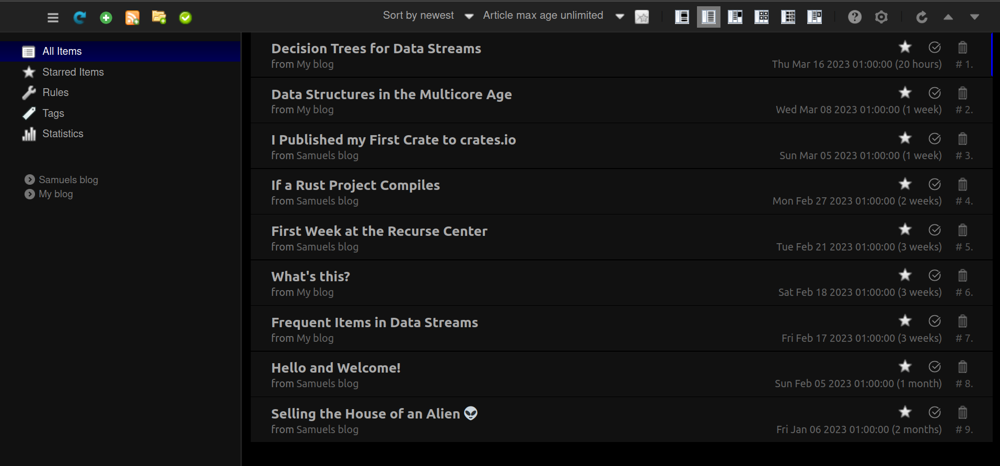

+++
title="How can I use web feeds to follow Samuel's blog?"
date=2023-03-17

[taxonomies]
categories = ["Blogging"]
tags = ["atom", "rss", "blog"]

[extra]
toc = true
+++

A couple days ago when I checked [Samuel's blog](https://samuelselleck.com/blog), as I do every now and then, I noticed that he had published a [new post](https://samuelselleck.com/blog/published-my-first-rust-crate/) a whole week ago. Imagine my horror when I realized I was a whole week late to this life changing information! I knew then that it was time to look into RSS and web feeds to find out how I can keep track of updates for things such as this blog. So today I will share my findings with you, so you also can follow Samuel!

<!-- more -->

")

# What web feeds are out there?

The only thing like this I had heard of before was [RSS](https://en.wikipedia.org/wiki/RSS), which [Myke Hurley](http://www.mykehurley.net/) often mentions on one of my all-time favorite podcast [Cortex](https://www.relay.fm/cortex). There I've many times heard about how they in some way use RSS feeds to keep track of updates of different kinds on specific websites, and notably it seems to have been the standard for podcasts for a long while.

Looking into it I find that RSS stands for Really Simple Syndication and has been around since 1999. By subscribing to RSS feeds from websites you can aggregate their output with a so called RSS reader such as [Feedly](https://feedly.com/). Its popularity has been going up and down, but seems to be sticking around.

Another syndication format is [Atom](https://en.wikipedia.org/wiki/Atom_(web_standard)) which appeared a few years later in 2005 as an alternative to RSS that could redo its mistakes and start fresh. It seems to be more powerful than RSS, and the only place it might not be as good is podcasting as RSS has some special features for that. Blogs seem to fit better with Atom, and Samuels blog supports that, so I'll go with it.

# How to follow a blog with atom?

The first step is to find a feed reader that supports Atom (most seem to support both Atom and RSS). I settled on [Feedbro](https://addons.mozilla.org/en-US/firefox/addon/feedbroreader/?utm_source=addons.mozilla.org&utm_medium=referral&utm_content=search) as it seems to be the most common web extension feed reader, and about as heavy as I need.

Installing Feedbro was as easy as adding an extension (exists on most browsers). Then you can add feeds to follow in the extension and any new blogs will appear in the Feedbro feed. It contains the whole blog post with images and working links, but it also redirects to the original blog. It also has a powerful rule engine where I for example can set up rules for notifications about updates in my feed, or just use the default badges on the extension icon.

To add a feed to the extension you can link to a feed xml link (eg. [https://samuelselleck.com/atom.xml](https://samuelselleck.com/atom.xml)) which it will track for updates. However, you have to find that xml link yourself, which can be hard for websites like Samuel's (unlike my own :D) where there is no visible link to the feed. And that's pretty much it. You can extend it further to your liking, but this is a good enough start.

# Conclusion

Web feeds are very simple. You just use a reader like Feedbro, and give it xml urls to track, and it aggregates all news in one place. You can then modify the reader to add things like notifications. The choice is up to you whether to read the texts in the feed reader, or continue to the original website, but I must say I prefer reading in the format of the original website.

So there you go. Now go install a feed reader and subscribe to Samuel's blog!
