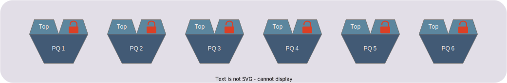
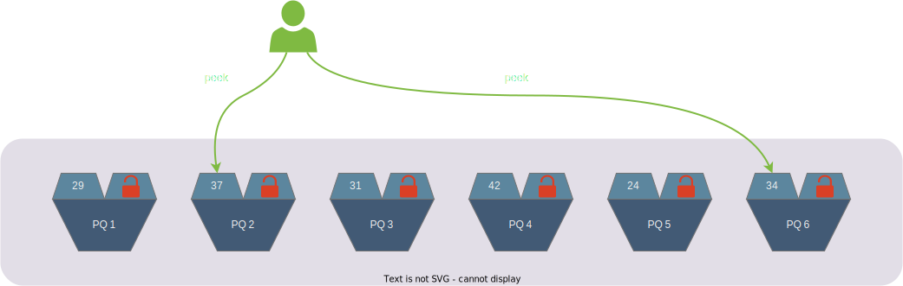
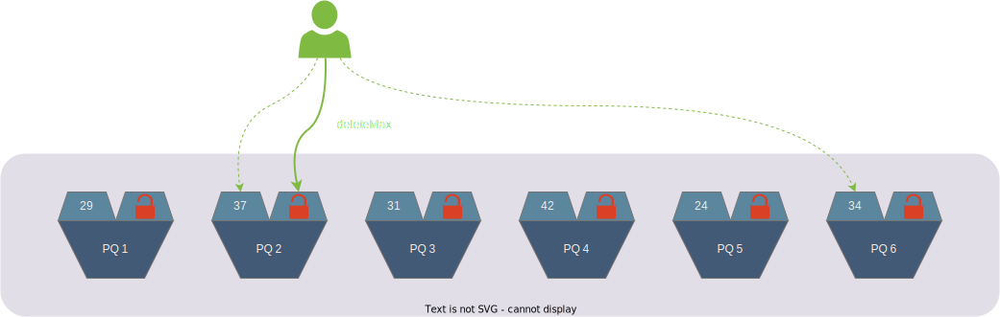
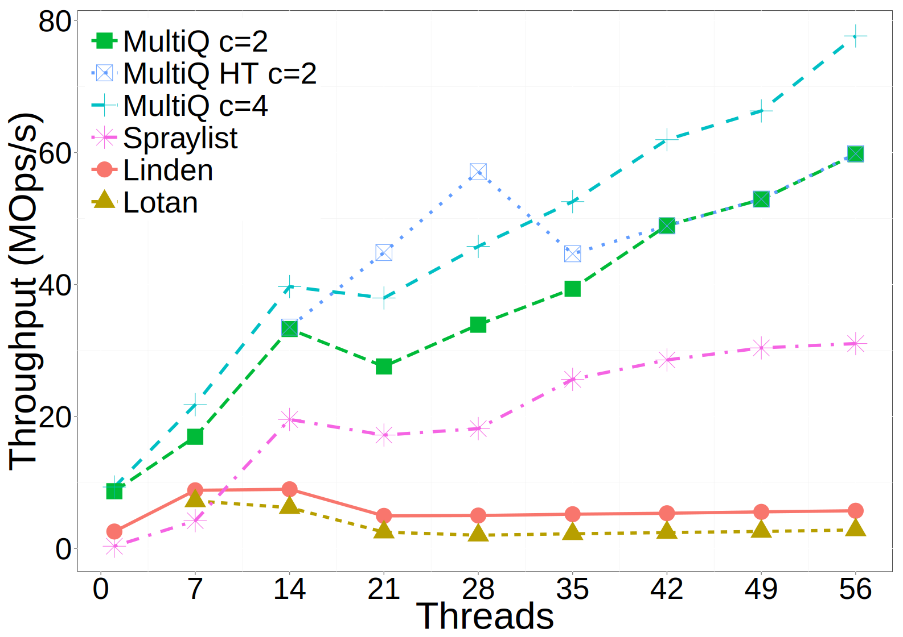
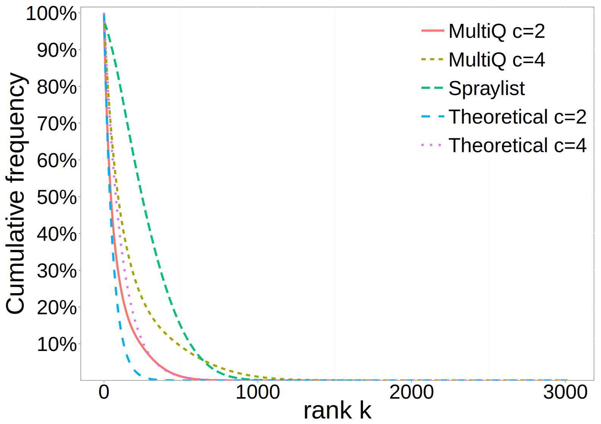
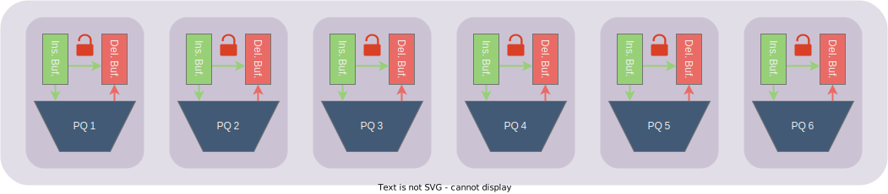
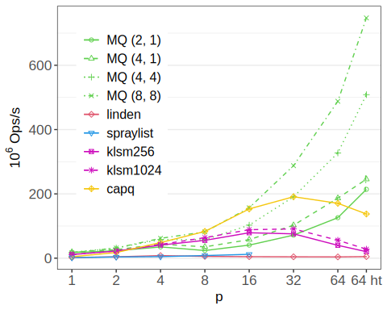
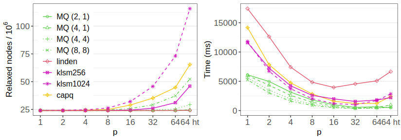
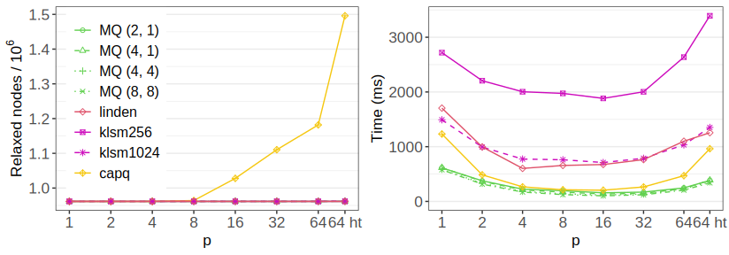
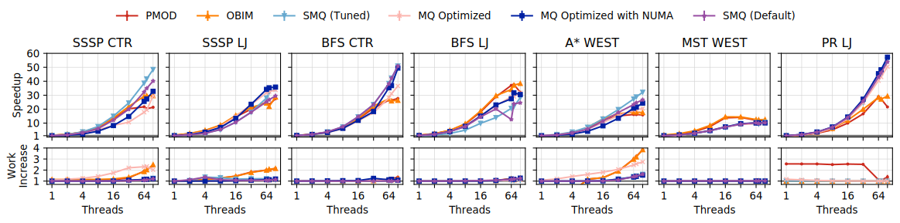

+++
title="MultiQueue: The Relaxed Priority Queue"
date=2024-04-19

[taxonomies]
categories = ["Research Insights"]
tags = ["relaxed semantics"]

[extra]
toc = true
+++

In the age of multicore computing, developers face the challenge of designing data structures that efficiently utilize the available hardware parallelism. One of the most important data structures is the priority queue, which is used in a variety of applications ranging from [graph algorithms](https://en.wikipedia.org/wiki/Dijkstra%27s_algorithm) to [data compression](https://en.wikipedia.org/wiki/Huffman_coding). Computer scientists often get taught some heap-based design of priority queues during university, where smart incremental updates enable good performance. However, trying to parallelize these designs is complex, as strictly incremental algorithms often are. In this post, we will investigate the _MultiQueue_, which is a relaxed priority queue which trades strict sequential semantics for massively increased scalability.

<!-- more -->

# Basic MultiQueue Algorithm

The MultiQueue was first introduced in the paper [MultiQueues: Simple Relaxed Concurrent Priority Queues](https://dl.acm.org/doi/10.1145/2755573.2755616) from 2015 by H. Rihani, P. Sanders and R. Dementiev. Its basic idea is to approximate the behavior of a priority queue by splitting it up into several _partial_ priority queues. Then, a load balancing scheme is used to try to select a good queue for each _insert_ or _deleteMax_.

As seen in the figure, each partial priority queue (PQ) is guarded by a lock for performing the _insert_ and _deleteMax_ operations. However, it also exposes the priority of its highest priority element (Top) that can be read without the lock, but only written when holding the lock.

Insert operations are kept very simple by just inserting into one of the partial PQ at random.

The key factor is in the _deleteMax_ operation. Here the thread first selects two partial PQ at random, peeking at both of their top priorities.

Then, the thread selects the partial PQ with the highest top priority, acquiring the lock and deleting from that queue.

Here it should be noted that the peek and deleteMax are not performed together atomically. It is possible that another thread deletes the item with the priority peeked in the peek step before you manage to do so. Therefore your actual deleteMax can delete another item than the one you peeked. You can choose to restart the whole operation if you see that the top priority has changed, but it has been shown to not have that much effect empirically.

So, inserts operate on a random PQ, and deleteMax peeks at the top priority of two random PQ and operates on the one with higher priority. The reason this scheme works is that the deletes act as a self-stabilizing mechanism that keeps the top priorities of the partial PQ relatively close over time. This stems from [the Power-of-Two choice](https://ieeexplore.ieee.org/abstract/document/963420), which is a very similar load-balancing mechanism that has been extensively studied in the past for a scenario of balancing the number of balls in several bins.

One important configuration we have glossed over is the number of partial PQ. This depends on how relaxed you want the MultiQueue to be, but usually these designs employ a number of partial PQ on the same order of the number of threads.

## Results

In this first paper, they included a short experimental evaluation as seen below. The evaluation is done on a two-socket Intel system where each socket had 14 cores (28 hardware threads). The first 14 threads were pinned to one socket, the 14 next to the other, and then the remaining 28 in the same manner, but using hyperthreads. The only exception is the MultiQ HT, which allocated hyperthreads before the second socket.

They compare versions of the MultiQueue where the number of partial PQ was a multiple of the number of threads (c), also one HT version that prefers hyperthreads. They also compare with the [SprayList](https://dl.acm.org/doi/10.1145/2688500.2688523) which is an earlier state-of-the-art relaxed priority queue. They included the [Lotan](https://ieeexplore.ieee.org/document/845994) and [Linden](https://link.springer.com/chapter/10.1007/978-3-319-03850-6_15) lock-free skip-list based priority queues as representations for scalable lock-free priority queues, as well as a lock-based 8-ary heap as a baseline.

Overall, the graph shows that the MultiQueue significantly outscaled the strict implementations, and also outpeformed the relaxed SprayList. The scaling is not super linear, which largely is due to sub-optimal scalability on multi-sockets.

Furthermore, the following plot shows the rank error, which is a measure of relaxation defined for a deleteMax operation as the number of other items currently in the queue with a higher priority than the deleted one. They also include some theoretical lines following a basic analysis model, which you largely can ignore here.

This shows that even while outscaling the SprayList in throughput, the MultiQueue maintains a much lower rank error average, leading to a less relaxed execution.

# Faster MultiQueues

In 2021, M. Williams, P. Sanders and R.Dementiev published [Engineering MultiQueues: Fast Relaxed Concurrent Priority Queues](https://drops.dagstuhl.de/entities/document/10.4230/LIPIcs.ESA.2021.81), where the two last authors are the same as the [first short paper](https://dl.acm.org/doi/10.1145/2755573.2755616). This paper fleshes out the MultiQueue design, adding optimizations and improving the analysis as well as experimental evaluation. Here, we will focus on the main two optimizations, which both has to do with improving cache performance.

## Buffering

The cache performance of a priority queue is not great, as it often has to traverse some tree-structure, touching several cache lines (they will mostly be misses due to randomness and updates from other threads). Therefore, the first optimization is adding insertion and deletion buffers to each partial PQ, as seen in green and red respectively below. These buffers are implemented as small sorted ring bufffers, often only taking up a single cache line. The idea is that most operations will only have to touch one of these buffers, which are only occasionally flushed to or from the PQ.

The key invariant is that the deletion buffer is sorted, and contains the highest priority items in the whole partial PQ (including the insertion buffer).

Now, instead of exposing the highest priority for each partial PQ, a thread can peek this priority without taking the lock by atomically reading the priority of the first item in the deletion buffer.

To insert an item into a partial PQ, it first checks if the item is of higher priority than the lowest priority item in the deletion buffer, in that case it is inserted into it. Otherwise, it is inserted in the insertion buffer. If the insertion buffer is full, it is first flushed to the PQ.

To delete the highest priority item, the first item in the deletion buffer is simply deleted. If the buffer is empty, it is refilled from the union of the insertion buffer and the PQ.

## Stickiness

Buffering decreases the number of cache lines most operations have to touch. Stickiness on the other hand tries to increase the temporal locality by having one thread go back to the same queue several times in a row. They define the stickiness as a positive integer _s_. Then each thread stick to the same partial PQ for _s_ consecutive operations, before using the normal scheme to find the next queue to stick to. A thread also de-sticks from a queue if it fails to aquire its lock.

## Results

Here we show some of their experiments on a 64-core AMD EPYC system. The first one is a synthetic benchmark for throughput, as seen below.

They compare several MultiQueues _MQ (c, s)_, where _c_ times the number of threads is the number of partial PQ, and _s_ is the stickiness. Again, they compare against the lock-free [Linden queue](https://link.springer.com/chapter/10.1007/978-3-319-03850-6_15) and the relaxed [SprayList](https://dl.acm.org/doi/10.1145/2688500.2688523). Furthermore, they compare with two relaxation levels of the relaxed [k-LSM](https://dl.acm.org/doi/10.1145/2688500.2688547), and the [CA-PQ](https://link.springer.com/chapter/10.1007/978-3-319-52709-3_23) which switches from a strict priority queue to a relaxed one depending on the contention.

In addition to the synthetic benchmark, they also used the priority queues for a label-correcting version of Dijkstras algorithm for the single-source shortest path (SSSP) problem. Below we to the left see the number of nodes explored for the different designs, and the runtime to the right, for the USA road network graph.

As we can see, their MultiQueue configurations consistently perform among the best designs for runtime, edging out all other ones at the highest thread count. However, it is very similar in runtime to the CA-PQ and the k-LSM. We also see that it does this while doing significantly less work than the other relaxed alternatives.

Below, we see similar plots for a randomized hyperbolic graph.

Here the different designs differentiate themselves a bit more, and we can see that the MultiQueue ends up on top, closely followed by the CA-PQ. However, these experiments are heavily dependent on the graphs used.

# The Stealing MultiQueue

The final MultiQueue design we will look at comes from the paper [Multi-queues can be state-of-the-art priority schedulers](https://dl.acm.org/doi/abs/10.1145/3503221.3508432) from 2021 by A. Postnikova, N. Koval, G. Nadiradze, D. Alistarh. They introduce the _Stealing MultiQueue_ (SMQ) and uses it for task scheduling in graph algorithms, like the SSSP problem.

The key idea utilized by this paper is the results of an [earlier theoretical paper]((https://dl.acm.org/doi/abs/10.1145/3087801.3087810)) that analyzed the probabilistic guarantees of the MultiQueue. It played with uneven probability distributions for selecting partial PQs, and found that the stability would hold up to a degree of imbalance in the distributions.

So, the SMQ creates and assign one PQ to each thread. Then, the threads are much more likely to operate on their own PQ than any of the others, leading to much higher temporal cache locality.

Inserts simply insert into the threads local PQ. DeleteMax on the other hand has a probability of *p* to select one other random queue, comparing its top to the local PQs top, and deleting from the one with higher priority. Otherwise it simply deletes from the local queue. They call this probability _p_ the stealing probability, hence the queue name.

However, to further improve performance for their task scheduling, they also incorporated the idea of **batching**. Each thread has a *stealing buffer*, which it refills when empty. When stealing from a remote partial PQ, you peek at the highest priority in the stealing buffer, and if it is larger than your top priority, you steal the whole buffer and merge it with your local PQ. By stealing several tasks at once, the probability to steal can be even lower while maintaining stability. Furthermore, threads only access other threads buffers and never their PQs, giving much better cache performance.

There are some other cool ideas in the paper, such as affinitizing the probabilities based on NUMA layout, how they use epoch counters for stealing the buffers, and some good theory. For that I recommend going to read the paper yourself!

## Results

This paper looks at the graph algorithms SSSP, BFS, A\*, MST, and PageRank (PR) on a variety of graphs. They compare different versions of the MultiQueue (MQ), for example utilizing batching, with their Stealing MultiQueue (SMQ), as well as the established priority-schedulers [OBIM](https://dl.acm.org/doi/10.1145/2517349.2522739) and [PMOD](https://dl.acm.org/doi/10.1145/3295500.3356160), as seen below. The runtime baseline is a singlethreaded implementation.

Here we see that these optimized MultiQueue designs finally outperform these specialized priority based task schedulers! At least on some of the experiments.

What is interesting is that the extra performance mainly comes from the fact that the MultiQueues give significantly lower rank errors than OBIM and PMOD, much as was seen in the earlier papers. So, maintaining these good rank error guarantees while achieving better cache performance, the SMQ shows itself as a very good option. However, as said before, it all depends a bit on the graph type and they notice the SMQ being much better at the wider road network graphs than the denser social network graphs.

# Conclusions

I think MultiQueues are a very nice class of relaxed data structures. They utilize the simple choice-of-two to get remarkable self-stabilizing properties, as well as very low contention. Compared to other relaxed data structures, relaxed priority queues are also relatively easy to implement, as strict concurrent priority queues are relatively slow and can pose large problems in parallel algorithms.

I am sure we will see some more really interesting work on MultiQueues. Both extending it with different capabilities and guarantees, and also applying it to different tasks. Even though I have glossed over it here, the MultiQueue design has a strong foundation in theory, and that in connection with its great practical performance is a golden ticket to an interesting research topic.

## Further Reading

If this post have made you interested in MultiQueues and the the topic of relaxed data structures, then I here present some suggestions for further reading. For a more thorough introduction to the problems and needs faced in modern shared-memory parallel programming, I have written about [Data Structures in the Multicore Age](@/blog/data-structures-in-the-multicore-age/index.md). I also have a more theoretical post about a [framework for defining relaxed data structures](@/blog/quantitative-relaxation/index.md).

The main MultiQueue articles I built this post around were:
- [MultiQueues: Simple Relaxed Concurrent Priority Queues](https://dl.acm.org/doi/10.1145/2755573.2755616), which proposed the MultiQueue design.
- [Engineering MultiQueues: Fast Relaxed Concurrent Priority Queues](https://drops.dagstuhl.de/entities/document/10.4230/LIPIcs.ESA.2021.81) by the same group, extending the design with optimizations to increase data locality and adding some analysis.
- [Multi-queues can be state-of-the-art priority schedulers](https://dl.acm.org/doi/abs/10.1145/3503221.3508432) by another group, where they extend the idea of the MultiQueue to fully leverage thread-local work and reduced communication for task scheduling in graph algorithms.

However, there are also a two important papers about the theoretical aspects and guarantees of the design pattern which I glossed over here:
- [The Power of Choice in Priority Scheduling](https://dl.acm.org/doi/abs/10.1145/3087801.3087810) performs the first thorough analysis of the MultiQueue design, giving strong probabilistic guarantees on its rank errors. However, this analysis is only done for simplified sequential processes.
- [Distibutionally Linearizable Data Structures](https://dl.acm.org/doi/10.1145/3210377.3210411) extends the analysis of the previous paper to also cover a subset of concurrent executions. It also coins the term _distributional linearizability_ for this type of randomized relaxation correctness condition.

I hope these will give a good foundation for reading about the MultiQueue, and that these papers' _Related Work_ sections provide many more interesting papers to read. For example, the core choce-of-two idea of the MultiQueue was applied to FIFO queues in the paper [Performance, scalability, and semantics of concurrent FIFO queues](https://dl.acm.org/doi/abs/10.1007/978-3-642-33078-0_20) three years before the first MultiQueue paper was published.