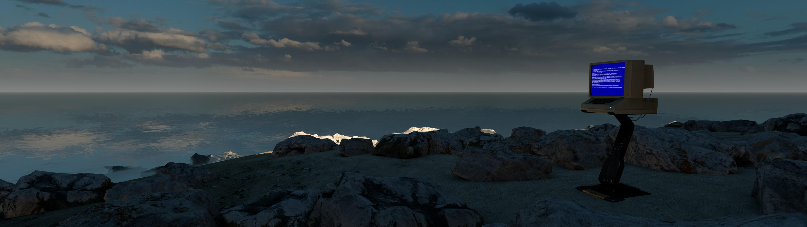
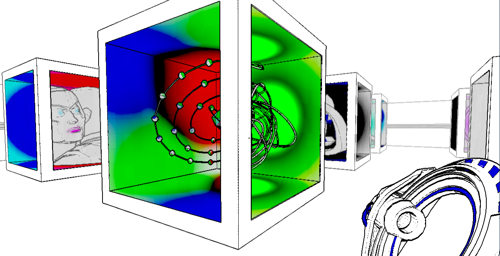
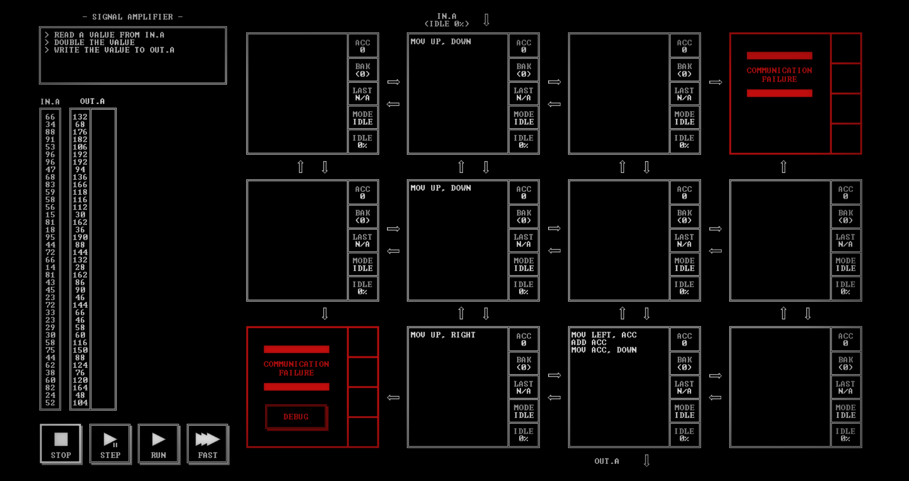
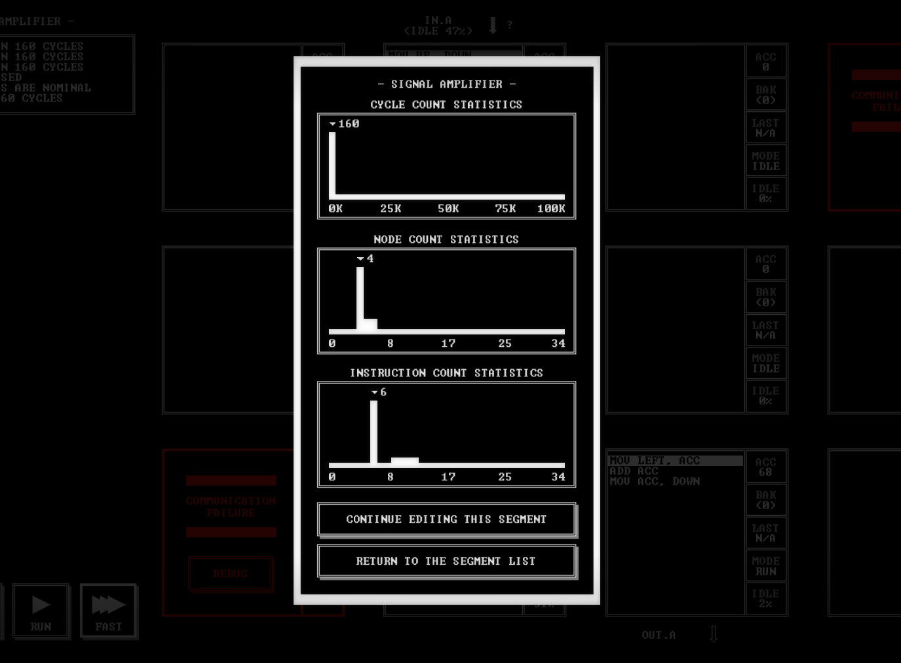
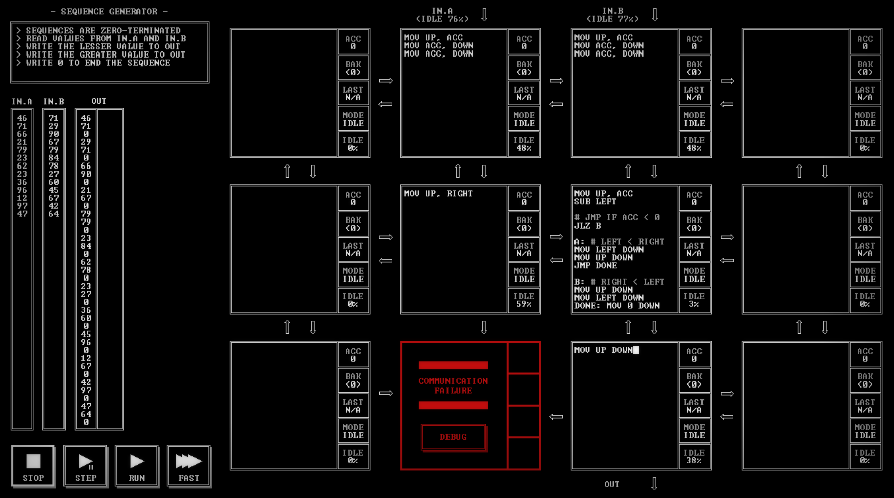
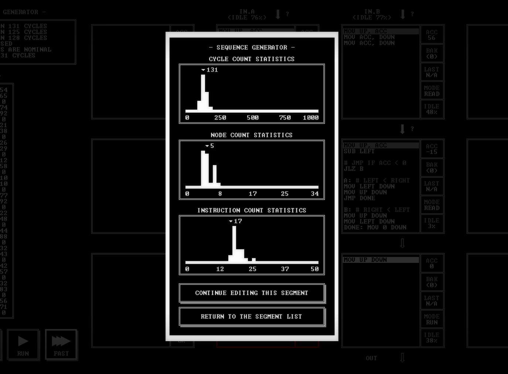

+++
title="From Puzzle Games to Programming"
date=2023-08-08

[taxonomies]
categories = ["Reflections"]
tags = ["gaming"]

[extra]
toc = false
+++

The first time I really programmed was a month or two into university, where I got assigned to do some array calculations in MatLab. During my first and second years, I further took two courses in Java which I found enjoyable, completing the labs when I needed a break from the other courses. At the end of my third year, I took two more programming courses (extra credit to Jonas Skeppstedt for his Algorithms & Data structures course), and from there I spiraled deeper into computer science, ending up as a PhD student. This post will be a small retrospective about what I think gave me the appetite for programming: Puzzle games!

<!-- more -->

During my teens, I played quite a lot of games, and at least some of that time taught me quite a lot. For example, World of Warcraft taught me about the free market with its auction houses. Civilization taught me about balancing investing against taking decisive action in the present. Hearthstone trained me in probability, basic strategy and analytical thinking. Furthermore, there were of course bangers like [Robot Roller-Derby Disco Dodgeball](https://store.steampowered.com/app/270450/Robot_RollerDerby_Disco_Dodgeball/) which just brought me a lot of joy.

However, as I said before, what I think influenced me the most toward programming was my time spent on puzzle games. Primarily there is one game studio I will focus on in this post, but before then, here are three puzzle games I would recommend to almost everyone:

### Portal

In Portal you get the ability to create and move a pair of portals in the environment, which you use to move yourself and objects in interesting and fun ways. It starts off simple with moving from one side of a pit to the other, but as time goes on you learn to utilize the portals to their fullest, exploiting the laws of energy conservation. Additionally, it has a good story which cements it as one of the all-time greats.

### The Talos Principle

This is a pleasant mix of philosophy and gaming, giving you challenging puzzles to focus on, while also presenting you with some thought-worthy ideas to ponder in between. The story is as relevant as ever with today's advancements in AI as it makes you reflect on the essence of being human. I will not spoil the story, but you quickly realize you are playing as a robot, solving strange puzzles in a desolate land with architecture inspired by ancient civilizations. Definitely a hidden gem.

### Antichamber

If you ever grow tired of classical physics and Euclidean geometry this game might be something for you. It repeatedly subverts your expectations about the game world, leaving you feeling incredibly confused and satisfied at the same time. It does not contain as hard puzzles as the other games, but forces you to find the puzzles yourself, and think outside the box to solve them. It is almost a mix between an art installation and a game.

# Zachtronics

Although other games are great, there is only really one game studio that I credit with introducing me to how to think as a programmer, and that is [Zachtronics](https://www.zachtronics.com/). Their core games all share a similar style (forming the Zach-like genre) which stems from programmatic ideas. They take a simple starting concept, often some form of programmable interface, and then craft increasingly intricate puzzles for it. You often get introduced to more complicated concepts over a game, but the real difference between the beginning and end of the game is that you are way more familiar with how to utilize the mechanics.

{{ youtube(id="Gk8JwvtVs38") }}
Their first big game was [SpaceChem](https://www.zachtronics.com/spacechem/) about fake chemistry. Here you have two independent transport dots named Waldos (think hardware threads) moving atoms around and combining them according to the tracks (programs) you create for each Waldo. The Waldos can pick up, combine, drop, rotate atoms, and much more depending on how you program their track. When you add conditionals and the possibility of chaining several of these production sites, the game becomes hard. It is basically programming two threads separately to work together to construct complex molecules.

{{ youtube(id="VV-2bu9za5s") }}
Their second main game is called [Infinifactory](https://www.zachtronics.com/infinifactory/), and is about building automated factories. By transporting blocks over conveyer belts, rotating them, welding them together (do you see some similarity to SpaceChem?), and so on, you turn several input streams into some desired output in each level. I really enjoyed how approachable this is, with pleasant 3D graphics and a rather good learning curve. It teaches us the importance of breaking down a problem into many small subproblems and is a great place to get into Zach-like games. Completing the levels can be hard, and once you have beaten one you get presented some histograms comparing the efficiency of your solution to other players. This is included in most games and makes you want to go back, redesign, compact, and specialize old solutions.

Infinifactory holds a special place in my heart, and there are a few additional great Zachtronics games. But now I want to move on to the game which maybe inspired me the most, changing how I thought about computers and algorithms.

## [TIS-100](https://www.zachtronics.com/tis-100/)

In this third Zachtronics game you inherit an old computer from your geeky uncle, and for some reason start trying to program a bunch of routines on it (the story is not really its strong suit). Along with the computer you get a [reference manual](./TIS-100%20Reference%20Manual.pdf), describing the architecture as well as its assembly language:

> The Tessellated Intelligence System is a massively parallel computer architecture comprised of non-uniformly interconnected heterogeneous nodes. The Tessellated Intelligence System is ideal for applications requiring complex data stream processing [...]

When I read this the first time, it told me basically nothing. But now, around eight years later, it sounds suspiciously similar to what I do in my PhD.

Below we can see how most of the levels look.
* In the center: A four by three grid of programmable execution nodes, some of which are corrupted (unusable). It is by programming these nodes, as I have done here, that we solve the level. Each node has a private accumulator (ACC) to use for operations, as well as a backup register (BAK).
* In the top left: The description of how our program should behave. In this puzzle, we should read a value from the input port, double it and write it to the output port.
* To the left: There is some test input, and the corresponding expected output, much like a unit test. If we write something that solves this test (and a bit more), we pass. Here you can see that the output is just the input multiplied by 2 at each line.

Let's take a quick look at how to program these nodes. Here are the main instructions:
* The most common instruction is `MOV X Y`, which moves a value from `X` to `Y`. These can be any of the neighboring ports, the node's private register (ACC) or a constant. As in the example, `MOV UP DOWN` moves the value from the port above to the port below. This instruction is blocking, so it waits for a value at the port above to be available, and only completes when the node below reads the port.
* Then there are the arithmetic instructions `ADD` and `SUB`, which adds or subtracts a value to the ACC. So `ADD 1` increments the accumulator by one. Notably, there are no more advanced arithmetic functions, such as multiplication.
* Furthermore, there are two more complex instructions about saving to, and swapping the value in the `BAK`. These are usually not needed, and even though `BAK` can contain values like `ACC`, it is often very painful to use well. See the [reference manual](./TIS-100%20Reference%20Manual.pdf) if you are interested.
* Finally, there are the jump instructions, which are not present in the example. The conditional jumps are associated with a comparison on ACC, so `JEZ LABEL` jumps to the line labeled `LABEL` if ACC equals `0`. There are also conditional jumps for when ACC is greater than zero, less than zero and not zero. Then there is an unconditional jump `JMP LABEL` which always jumps to the labeled line.

With this we can see how the program above moves the input values down to the final node, where it stores the value in ACC, then adds ACC to itself (doubling it), and outputs the doubled value from ACC.

When completing the level we get presented with the following histograms, which show us how we did in comparison to other players. It compares how long the test took to run, how many nodes you used, and how many total instructions you wrote. This is a simple level, but these histograms encourage you to try to create small, elegant and fast solutions. This might be what made me love my university course on Algorithms and Data structures, as I after this yearned for making my code fast and clever, as was needed here.

Below you can see a slightly more advanced program, where we get two input values from different ports, and then are supposed to output the smaller one followed by the larger one, and then a `0`, repeating for all input pairs. Here I have created a simple program that sends each input to the middle node twice. The first values are subtracted from each other, and that result is then used to determine the order in which the second copies of the values are outputted (the first copies are consumed when we subtract them).

In these histograms, we can see that we did quite well, but it seems we could have used only four nodes. Can you spot which one is unnecessary? It also seems we can shave off some cycles. How do you think this could be done?

## Playing TIS-100

When I first played this game I both really enjoyed it, but also found it quite boring. Visually it is very plain, almost entirely made out of white text on black background and this is probably the main issue I have with the game (I don't know how to fix it). Therefore I would probably recommend Infinifactory before TIS-100 to people new to these kinds of puzzles. In my first playthrough, I liked the idea of playing more for the puzzles than the spectacle, but in all honesty, I quit before finishing around half of the puzzles.

One thing I really enjoyed was the fact that I could print out the computer manual as a reference while playing. Having something on paper always adds some extra enjoyment for me, and it was a much better experience than switching around different windows on the computer.

I recently went back and played through the main campaign, and fell a bit in love again. The initial levels were much easier now that I have programmed a lot, but I will admit I got stuck for a while on the penultimate level on sorting sequences. I would really recommend this game to anyone who really enjoys programming (especially if you enjoy writing low level algorithms).

# Should you play games to learn programming?

I am very grateful for everything I have learned from games. However, I am not sure they are the most effective way to teach people the concepts I learned from them, as you for example could go program in C rather than play TIS-100. But I do think games can play an important part in educating people. Mainly because they can be more accessible than the real topics, focus only on interesting concepts, and can gamify the learning. To hit that sweet spot with a game is hard, but I think Zachtronics did a great job in many ways.
