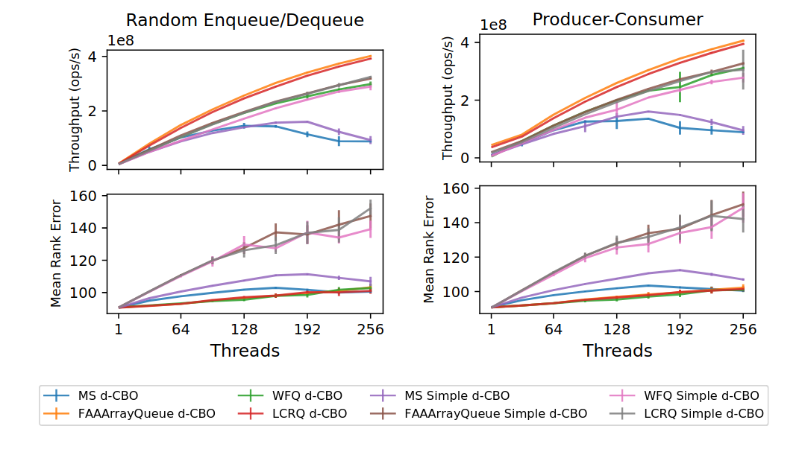
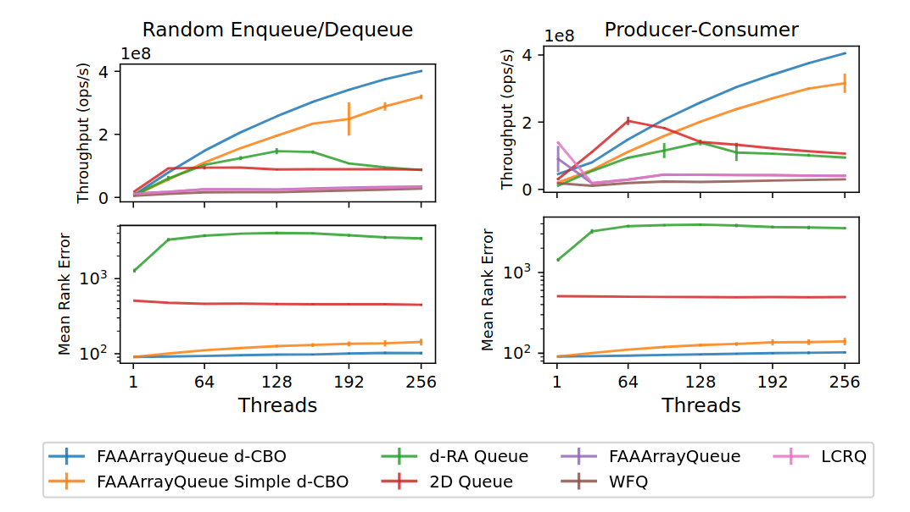
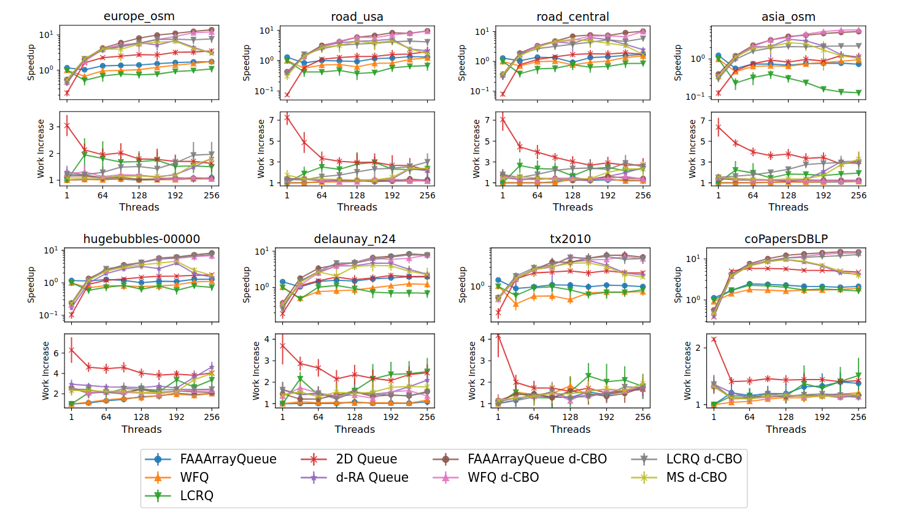

+++
title="d-CBO: The Randomized Relaxed FIFO Queue"
date=2026-01-09

[taxonomies]
categories = ["Research Insights"]
tags = ["relaxed semantics", "lock-free"]

[extra]
toc = true
+++

The strict semantics of many concurrent data structures are often useful when designing algorithms.
However, such semantics make achieving high degrees of parallelism problematic for data structures such as FIFO queues, where operations contend for a few shared access points (the _head_ and _tail_ in this case).
Thus, such data structures suffer large synchronization overheads under high contention, severely limiting scalability.

Relaxed concurrent data structures were introduced as a way to alleviate such synchronization bottlenecks.
They achieve this by weakening the ordering semantics of the data structure, essentially trading some order (in a controlled manner) for parallelism.
This post introduces the _d_-CBO queue, which is a state-of-the-art relaxed FIFO queue.

<!-- more -->

Relaxed FIFO queues are specified by allowing dequeues to return _one of_ the oldest items, instead of solely the oldest item.
The degree of relaxation is characterized by _rank errors_ and _delays_, which are measured for dequeue operations.
The _rank error_ of a dequeue is the number of items skipped. So if dequeueing _x_ at time _t_, the rank error is the number of items in the queue at _t_ which were enqueued before _x_.
On the flip side, the _delay_ of a dequeue is how many times the dequeued item has been skipped. So if dequeueing _x_ at time _t_, the delay is the number of items dequeued before _t_, which were enqueued after _x_.
Rank errors and delays often go under the umbrella term _relaxation errors_.

# The _d_-CBO Relaxed FIFO Queue

The _d_-CBO was originally published in the paper [Balanced Allocations over Efficient Queues: A Fast Relaxed FIFO Queue](https://doi.org/10.1145/3710848.3710892) at PPoPP 2025. The thesis [Semantic Relaxation of Concurrent Data Structures](https://karevongeijer.com/licentiate/semantic-relaxation-of-concurrent-data-structures:efficient-and-elastic-designs.pdf#chapter.1) includes a version of the paper with a slightly revised analysis.
The core idea of the design is to split up the queue into _n_ sub-queues, directing each operation to one sub-queue with the [greedy d-choice](https://homes.cs.washington.edu/~karlin/papers/AzarBKU99.pdf). This reduces contention, as threads will spread out over several disjoint sub-queues. As we will discuss later, the sub-queue selection scheme also guarantees low relaxation errors. Furthermore, to achieve high performance, the _d_-CBO has a generic interface for sub-queues, enabling state-of-the-art concurrent FIFO queues to be used.
The name _d_-CBO stands for the _d_-Choice Balanced Operations Queue, as it uses the [greedy d-choice](https://homes.cs.washington.edu/~karlin/papers/AzarBKU99.pdf) to balance operation counts across internal sub-queues.
Let's look at how this works in more detail.

**Sub-queue Design Pattern.**
The _d_-CBO is implemented as a set of internal concurrent FIFO queues, called sub-queues. Each enqueue or dequeue on the _d_-CBO will be directed to operate on one of these sub-queues (so, there is no duplication of items across sub-queues). This is a common design pattern in related work. If there is a single sub-queue, the relaxed queue behaves as a normal concurrent FIFO queue. As the number of sub-queues increases, so does the relaxation. How to select which sub-queue each operation operates on is what decides the ordering guarantees.

**Sub-queue Selection.**
The _d_-CBO tries to balance the _operation counts_ (the number of enqueues and dequeues) across sub-queues using the d-choice.
This means that an enqueue selects _d_ (_d > 1_ and usually _d = 2_) sub-queues at random, enqueueing into the sub-queue with fewest prior enqueues. Similarly, a dequeue selects _d_ sub-queues at random, dequeueing from the sub-queue with fewest prior successful dequeues.

There is one exception for this. When trying to dequeue from an empty sub-queue, the dequeue will not return _NULL_. Instead, it will iterate over all sub-queues, trying to dequeue from each of them. It will only return empty if it has iterated over all sub-queues _twice_, and it in the second iteration saw that no enqueues had taken place between the two iterations. This can be seen as a double-collect, and ensures that there was an instant where _all_ sub-queues were empty between the two iterations. Thus, dequeues only return _NULL_ when the whole _d_-CBO queue is empty (not just a sub-queue), guaranteeing what we call empty-linearizability (not strictly required for relaxed queues, but very useful).

**Sub-queue Interface.** To facilitate easy integration with state-of-the-art queues, the _d_-CBO's sub-queues need only fulfill a quite simple interface:
- **Enqueue and Dequeue**: The sub-queue must expose linearizable enqueue and dequeue functions.
- **Enqueue and Dequeue Counts**: The sub-queue must be able to return the number of enqueues and successful dequeues which have linearized. These counts can be approximate, but preferably as close to exact as possible (otherwise increasing relaxation errors).
- **Enqueue Version**: The sub-queue must be able to return a version count, which should be unique for each current tail of the queue. That means that the enqueue version must change to a new _unique_ count at the linearization of each enqueue. Furthermore, the enqueue version is allowed to change without any enqueue linearizing, but it is only allowed to change a finite number of times before an enqueue linearizes.

If these functions are implemented in a lock-free manner, the paper shows that the _d_-CBO queue becomes lock-free and linearizable (including empty-linearizable). The interface is designed with state-of-the-art FIFO queues in mind, and the paper shows how to for example implement the [LCRQ](https://doi.org/10.1145/2517327.2442527) by Morrison and Afek, or the [YMC queue](https://doi.org/10.1145/3016078.2851168) by Yang and Mellor-Crummey.

## Analysis
The interesting analytical question is how large the rank errors and delays are in the _d_-CBO queue (how relaxed the queue is). The main result, shown in the paper (revised in the [thesis](https://karevongeijer.com/licentiate/semantic-relaxation-of-concurrent-data-structures:efficient-and-elastic-designs.pdf#chapter.1)), essentially shows that the errors are _O(n log n)_ with high probability (in _n_), where _n_ is the number of sub-queues. The analysis assumes a sequential setting, and that all enqueues are done before any dequeues, which are standard assumptions in related literature.

The key idea is to utilize the deep research into the d-choice process. The paper [Balanced Allocations: A Simple Proof for the Heavily Loaded Case](https://arxiv.org/abs/1310.5367) by Talwar and Wieder gives a very nice analysis of this _d_-choice, which can be utilized in the _d_-CBO analysis. Their Theorem 2.1 implies that the difference in completed enqueues between any two sub-queues is with high probability _O(log n)_. Due to our simplifying assumption, it also bounds the difference in dequeue counts to _O(log n)_. The _d_-CBO paper shows how the difference in all enqueue and dequeue counts, at the times of enqueueing and dequeueing an item, bounds the rank and delay errors, leading to the bound of _O(n log n)_ with high probability when summing over all sub-queues.

# Experimental Evaluation

The _d_-CBO queue is shown to achieve good trade-offs between performance and relaxation in practice. The following figure shows how the throughput and rank errors scale with threads, using 128 sub-queues, for different sub-queues in producer-consumer and random enqueue/dequeue micro-benchmarks. MS is the classical [Michael and Scott queue](https://www.cs.rochester.edu/u/scott/papers/1996_PODC_queues.pdf), WFQ is the [wait-free queue by Yang and Mellor-Crummey](https://doi.org/10.1145/3016078.2851168), the [FAAArrayQueue by Ramalhete and Correia](https://concurrencyfreaks.blogspot.com/2016/11/faaarrayqueue-mpmc-lock-free-queue-part.html), and finally the [LCRQ by Morris and Afek](https://doi.org/10.1145/2517327.2442527). It also includes _Simple_ versions of each sub-queue, where the enqueue and dequeue counts are computed externally and not taken from internal queue counters.

The figure shows that using state-of-the-art concurrent FIFO queues based on fetch-and-add, significantly outperforms simpler implementations such as the MS queue, used by most other relaxed FIFO queues. Furthermore, although easier to implement, the _Simple_ designs are not as performant, showing engineering and good understanding of the sub-queues is important for best performance.

The following figure instead compares the _d_-CBO queue against state-of-the-art relaxed and normal concurrent FIFO queues. The [_d_-RA queue](https://doi.org/10.1145/2482767.2482789) by Haas et al. is a similar randomized relaxed queue to the _d_-CBO, and the [2D queue](https://drops.dagstuhl.de/entities/document/10.4230/LIPIcs.DISC.2019.31) by Rukundo et al. is a relaxed queue with deterministic relaxation error bounds. All relaxed queues use 128 sub-queues.

The figure shows that the _d_-CBO outscales previous relaxed queues, achieving both higher throughput and lower rank errors. Compared to the 2D queue, we see that the power of randomization can give significantly better performance in practice, and comparing to the _d_-RA queue we see that fast sub-queues and careful sub-queue selection are important for performance.

Finally, the following figure shows execution time and work-efficiency (lower is better) for a parallel breadth-first-search (BFS) benchmark using a centralized work queue. It compares against the same queues as above, again using 128 sub-queues, over 8 different graphs.

The different graphs lead to different results, but the _d_-CBO is consistently the fastest at high thread counts. Using a centralized relaxed work-queue in similar algorithms gives rise to work-inefficiency, where some tasks have to be done several times for correctness (this actually happens also when using non-relaxed concurrent queues). The figure shows that the _d_-CBO queue maintains very good work-efficiency, due to its low relaxation errors, which helps its good run-times.

# Related Work

<!-- d-RA queue -->
**_d_-RA Queue.** The most similar relaxed queue in the literature is the [_d_-RA queue by Haas et al. from 2013](https://doi.org/10.1145/2482767.2482789), and in the linked paper they also introduce several other sub-queue relaxed designs. The _d_-RA queue is implemented as _n_ sub-queues. Enqueues (dequeues) select _d_ sub-queues at random, enqueueing into (dequeuing from) the shortest (longest) sub-queue, essentially trying to balance sub-queue lengths. This sub-queue selection is neat, but lacks analytical guarantees on relaxation errors. The _d_-CBO paper shows that the _d_-RA relaxation errors scale with factors such as queue size, making it sub-optimal. Furthermore, it uses the Michael and Scott queue as sub-queues, making it slower than the _d_-CBO.

<!-- MultiQueue -->
**MultiQueue.** The MultiQueue, originally introduced by [Rihani et al. in 2015](https://doi.org/10.1145/2755573.2755616) also uses sub-queues and the _d_-choice to implement a relaxed queue, but this time a relaxed priority queue rather than a FIFO queue. The MultiQueue has proven very powerful, and there have been continued development and adaptation of it. Williams and Sanders published a comprehensive [journal version](https://doi.org/10.1145/3771738) on the design in 2025, which I recommend if you are interested. I have also written an earlier [blog post on the MultiQueue](@/blog/multiqueue-introduction/index.md), which can be a good starting point (although it misses some more recent developments).

<!-- Quantitative Relaxation -->
**Relaxation.** If you are more interested in the general ideas behind relaxed data structures, I recommend the great paper [Data Structures in the Multicore Age](https:///doi.org/10.1145/1897852.1897873) by Shavit from 2011, which I have also written an earlier [blog post](@/blog/data-structures-in-the-multicore-age/index.md) about. The paper describes scalability issues in concurrent data structures, going from how lock-freedom outscales locks, to how ideas like relaxation can be useful. Furthermore, if you are interested in how relaxed data structures can be formalized, I recommend the paper [Quantitative Relaxation of Concurrent Data Structures](https://doi.org/10.1145/2480359.2429109) by Henzinger et al. from 2013. It is a bit more of a heavy paper, formalizing relaxation based on transitions costs in sequential histories, and I've tried to simplify its key ideas in an [earlier blog post](@/blog/quantitative-relaxation/index.md).

<!-- Balls into bins -->
**_d_-Choice.** Finally, the _d_-CBO analysis and sub-queue selection is based on the rich literature of the greedy _d_-choice in the balls-into-bins problem. The problem itself is usually stated as one having _n_ bins, each with a certain number of balls, and then at each instant, you allocate a ball into the least loaded out of _d_ randomly selected bins. Using _d > 1_ gives that the bins will be relatively even in load, but using _d = 1_ makes them diverge over time. There are many nice papers in this field, and the main one used in the _d_-CBO analysis is [Balanced Allocations: A Simple Proof for the Heavily Loaded Case](https://arxiv.org/abs/1310.5367) by Talwar and Wieder.

# Conclusion

In conclusion, the _d_-CBO queue efficiently utilizes the _d_-choice to achieve probabilistic guarantees on low relaxation errors, and integrates with fast sub-queues for good performance. It is simple to understand, and relatively easy to implement and extend, which I hope will make it interesting to a wide range of people.
