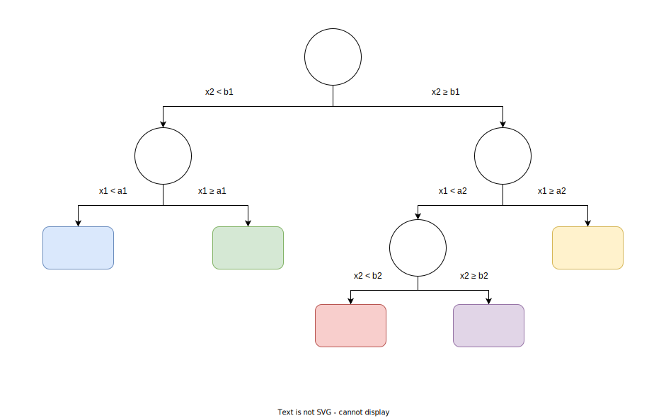
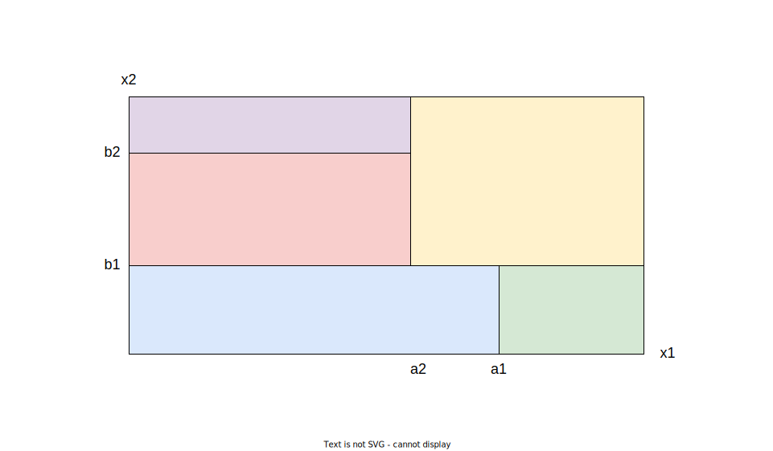
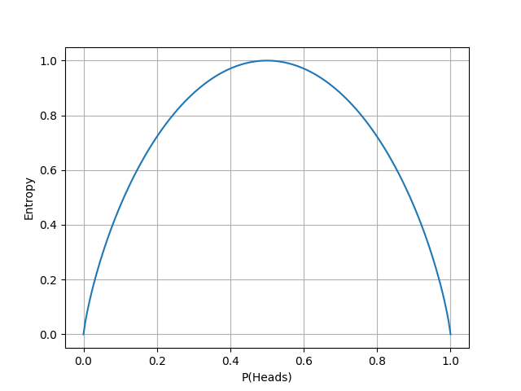
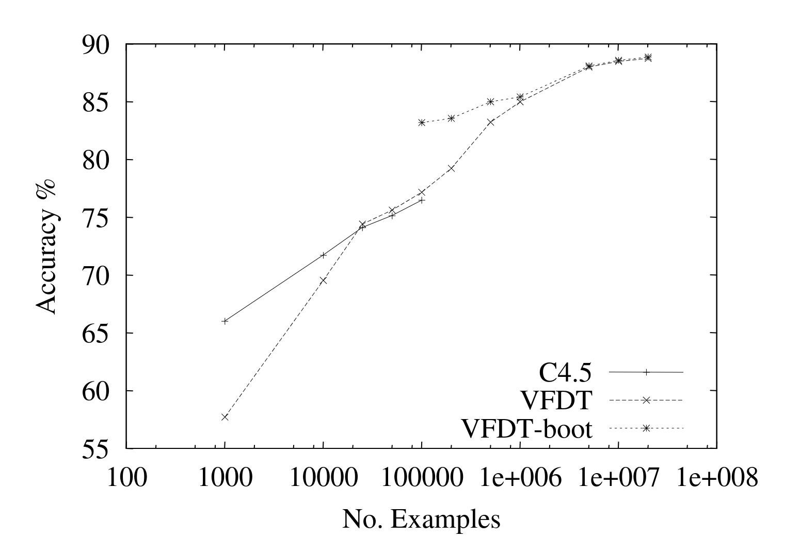

+++
title="Decision Trees for Data Streams"
description="An introduction to stream processing and the frequent item problem. We look at three algorithm types, but mainly on the nice idea of sketches."
date=2022-03-16

[taxonomies]
categories = ["Research summary"]
tags = ["stream data", "decision trees"]

[extra]
toc = true
+++

Decision trees have been around for several decades as a form of machine learning to mainly classify data. From my own experiences at school and [Axis](https://www.axis.com/) I saw decision trees as simpler and more explainable when compared to neural networks, but also with less potential. However, it seems that they are used a lot in data mining, where the learning has to be done online. So here we will give a short introduction of decision trees and their online versions.

<!-- more -->

# Basic Decision Trees

By learning from data decision trees recursively partitions the input domain into smaller and smaller subsets, trying to maximize the homogenity in each such subset. Each data point is represented as some feature vector ```[x1, x2, x3 ...]```, and each node on the tree sends data points to different children nodes depending on the value of one of those features.



This can be seen as dividing up the input domain into several nonintersecting hyper-rectangles. Then each data point will fall into one of those regions and be classified thereafter. The hyper-rectangles seen below are from the simple decision tree above with only two features.



## How to construct them

Here is pseudo code for the construction of a very simple classifying decision tree. This is similar to the old algorithm [ID3](https://en.wikipedia.org/wiki/ID3_algorithm) and at each split it creates a new child for each possible value of the chosen feature. Another way, as shown in the figures above, is to do a binary split each time based on some inequality test. It uses the same ideas, but is slightly finnicky.

``` rust
fn split(node, dataset)
    if !stopping_criterion(dataset)
        feature = best_split_feature(dataset)
        for value in possible_values(feature)
            child = new_node()
            split(child, {x | x[feature] == value} for x in dataset)
            node.add_child(child)
    else
        node.class = most_common_class(dataset)

```

The stopping criteria can be chosen in many ways. A simple solution is to have a lower threshold on the size of the dataset, and another is to threshold the maximum depth of the tree. A more complicated stopping criteria could look at how much information we would get out of the split, or how homogene the dataset is.

## Information theory

The theory of decision trees uses information theory in order to formalize what it means to maximize the homogenity, which is needed when selecting optimal splits of the dataset. These are often based on the notion of *entropy* (H), which measures the amount of randomness in a random variable.


H(X) = -\sum_{j}p_j log_2(p_j)


In the following graph we show the entropy for a coin flip depending on how it is weighted. If it always or never gives heads we don't have any entropy, as there is no randomness. It is maximized when there is equal probability for heads and tails, as is then is as hard as possible to guess what will happen.



Using entropy we can define *information gain* (G) as the amount of information gained about one random variable by observing another random variable. For decision trees this can be viewed as the decrease in entropy between the parent node and the weighted average of the child nodes for a split on a certain feature. So to select a good split we can maximize this. Here *F* is one of the features and *v* one of its possible values.


G(X, F) = H(X) - \sum_v\frac{|X_v|}{|X|}H(X_v), \hspace{2em} X_v = \{x \in X~|~x[f] = v\}


If we don't want to create a child for each possible value of the feature we can combine some  X_v  by taking the union of the sets, and summing over those unions. Or if we have a continuous variable we can only create two children and have  X_v  be the samples in each of them, but then you have to find where to split which can be expensive.

## Overfitting

Classical decision tree algorithms are very prone to overfitting, as they can continue building the tree until it is completely pure. A simple solution is no not make it completely pure, like the stopping criteria in our pseudo code. However, here we will look closes at two more interesting methods, namely pruning and random forests.

### Pruning

Pruning is when we remove leaves (bottommost nodes) in the tree to make it smaller and reduce overfitting. The simplest way is to iterate over all twigs (nodes whose children are all leaves), and remove those who don't contribute that much information gain.

Another approach could be to split the data set into training and validation and use the validation for pruning only. Then we can use the tree to classify the validation set and prune the twigs which misclassify the most.

There are other ways to prune we wont go into, such as minimizing computational complexity or randomized pruning of entire subtrees.

### Random Forest

Here we train several decision trees, and during classification combine their votes (eg. take weighted average). To not have them all be identical (just as using one) they must train on different training data sets. The following methods and image are from a lecture in the Applied Machine Learning course I took at LTH, given by [Elin Anna Topp](https://scholar.google.com/citations?user=uNq-sBIAAAAJ&hl=en).

One way is to use so called bootstrap replication, as shown below. Here the idea is to, for each tree, sample (with replacement) a number of points from the training data and use them for training. As the sampling is different for each tree they should hopefully not be overfit in the same ways.


Another similar idea is bagging (bootstrap aggregating) which trains a number of classifiers as above, but then estimates all of their performances on the original data after training. Those performance scores can for example be used as weights when voting on classifications.

A third idea is called boosting (eg. AdaBoost) and its base idea is to turn several weak learners (trees) into a strong one. Here we build the separate trees in sequence and over time adjust some learning weight for each training sample. If one tree misclassifies a sample it will increase that sample's weight, increasing the probability that successive trees will learn to classify it correctly. The hope then is that they will fail at different things, and that their combined classification will be robust and stronger than each individual tree.

# Hoeffding Trees

The construction as described so far requires you to recursively partition the dataset, but now we want to create an online training algorithm to be able to use for streams. This idea comes from the paper [*Mining High-Speed Data Streams*](https://dl.acm.org/doi/10.1145/347090.347107) by Pedro Domingos and Geoff Hulten back in 2000. The idea is that we only need relatively few training samples to decide which feature to split at for each node. Once enough samples have been found for a node to make a decision it is split and succeeding examples are passed down to the new children.

To decide how many samples are required for these split they use the statistical [Hoeffding bound](https://redirect.cs.umbc.edu/~lomonaco/f08/643/hwk643/Hoeffding.pdf). Given a real-valued random variable  r whose range is  R , and of which we have made  n  independent observations, computing its mean  \bar{r} . Then the Hoeffding bound states that the error of the approximated mean is at most  \epsilon  with a probability of  \delta , where  \epsilon = \sqrt{\frac{- R^2 ln(\delta)}{2n}}. 

The idea then is to use this to collect samples in a node, until we with a probability of  1 - \delta  know which is the optimal split. This is done by continually computing the information gain for the features, and comparing if the difference between the two largest gains is big enough.

 \Delta \bar{G} = \bar{G}(f_1) - \bar{G}(f_2) \gt \epsilon 

Using this idea we can form the Hoeffding tree algorithm. One thing we have not covered yet is how it remembers data for each node. This is done in a simple way by keeping counters  n_{ijk}  for each node, where *i* denotes a feature, *j* a value of that feature and *k* the class of the training data. This only works for nominal values, and ot seems to still require quite a bit of memory when the tree grows if we have a lot of features, values and classes.

# Very Fast Decision Trees (VFDT)

The [VFDT](https://dl.acm.org/doi/10.1145/347090.347107) system is an efficient implementation of the Hoeffding algorithm, making a few smart improvements. We break them up into the subsections below.

#### Ties

If two features are as good, or very close, when it comes to splitting on the original algorithm would take a very long while until it could select a split. However, in these situations the choice of split has very little effect, as the two attributes are so similar in quality. So VFDT instead decide that it is a tie by checking if  \Delta \bar{G}  is smaller than a user specific threshold in some situations.

#### Information Gain Computation

Recomputing the information gain for every new sample is inefficient and takes up the majority of training time. So VFDT only recomputes it every couple of samples (can be reconfigured by user), speeding it up *a lot*. However, this will effectively use a smaller  \delta  as we now will wait longer before splitting. Therefore it can be chosen slightly larger to offset this.

#### Memory

As mentioned earlier the counts for each leaf will take up a lot of memory and can potentially fill up the RAM. By estimating how important certain leaves are (how many samples times its classification error rate) VFDT will deactivate the least promising leaves when memory becomes an issue, freeing their counts. Leafs can later be reactivated (with all counts reset) when their old estimated importance becomes higher than the active leaves. 

#### Poor Features

Features with low estimated information gain in a leaf take up a lot of memory with their counters. By dropping the counters to all features whose difference in information gain to the best one is larger than  \epsilon  we can save a lot of memory.

#### Initialization

By using the offline method on an initial subset of the data, VFDT gets a head start, making it reach higher accuracies faster. This makes it better in cases where the naive Hoeffding algorithm would have been underfit. 

In the paper they don't motivate this much, but personally I feel that this is a rather strange thing. Of course this is good for smaller datasets, but should we then not use some other offline method? I guess one other advantage of VFDT other than the memory use is its speed, so that might give it a use case for these medium sized data sets.

#### Rescans

This final idea is similar to the last one and enables us to gain more information from each data sample. The idea is that we can rescan subsets of the previously seen data to continue building the tree. One use case is if we have infinite data, but it arrives slower than we can process it, and another is if the data set is small, making this more like a normal offline algorithm.

This is not trivial like the other optimizations and they don't do any analysis in the paper. If a sample is reused and the node it reached previously has since been split, it becomes like an offline algorithm, using the data point in the child as well. But if it reaches the same node and counter twice, we suddenly have a misguided statistic of occurrences. I guess it depends on how you view the use of this, but it would be nice with some more discussion.

## Evaluation

The original paper ran some tests comparing VFDT to C4.5 which is an offline method, similar to the one shown above. They also used a bootstrapped VFDT that started with a pruned tree from C4.5 as initial state. Here we can see the difference in accuracy on synthetic data.



The accuracy looks rather good, especially the bootstrapped one on smaller sizes. Here we instead can see the memory useage of the different constructed trees, based on how many nodes they create (the final tree size) for the same data.


If you are interested in more tests there are many in the [paper](https://dl.acm.org/doi/10.1145/347090.347107), such as leison studies and tests on web data. But they suggest that VFDT gives good results and can continue to scale on large amounts of data. I swear I saw a graph somewhere comparing training speed of VFDT and some offline method as well, with interesting results, but now I can't find it for the life of me.

## Extensions to VFDT

There have been quite a few extensions to the VFDT algorithm, and I recommend reading about them in the book "Knowledge Discovery from Data Streams" by João Gama, or the linked papers. We will not go over them here, but these are a few examples.
* [**Continuously Valued Features**](https://dl.acm.org/doi/10.1145/956750.956813). Here the values don't have to have a finite set of possibilities and we often instead do binary splits based on some inequality. This is in my opinion required for an ML algorithm to be relevant.
* [**Functional Tree Leaves**](https://dl.acm.org/doi/10.1023/B%3AMACH.0000027782.67192.13). The normal algorithm classifies all samples reaching a leaf as the most represented class in the training data in that leaf. Instead we can use naive Bayes classifiers, which instead maximizes the posterior probability based on Bayes theorem.
* [**Concept Drift**](https://dl.acm.org/doi/10.1145/1066677.1066809). In time changing environments the classification strategy can change over time. For many models this requires the recomputation of the whole model, but as decision trees correspond to a hierarchy of hyper-rectangles it is enough to recalibrate the part of the tree that is changing.


# Conclusions

Overall I think VFDT is interesting and probably has a place in mining data streams. But, from my understanding decision trees are often outperformed by neural networks, so I would like to see some paper try data mining (on huge data sets) with that as well. In some cases decision trees are very good (eg. I know XgBoost is successfully used for some personalized search engines), so I might be wrong to worry, but decision trees feel a bit dated to me. For example splitting on one variable at a time feels a bit stupid (think of how it would classify two classes separated by a diagonal line in 2D space).

Disregarding my skepticism of decision trees, VFDT uses some really interesting techniques and tricks to handle the online case. Furthermore, the field of information theory used is fascinating and those ideas can be used in other fields as well.


