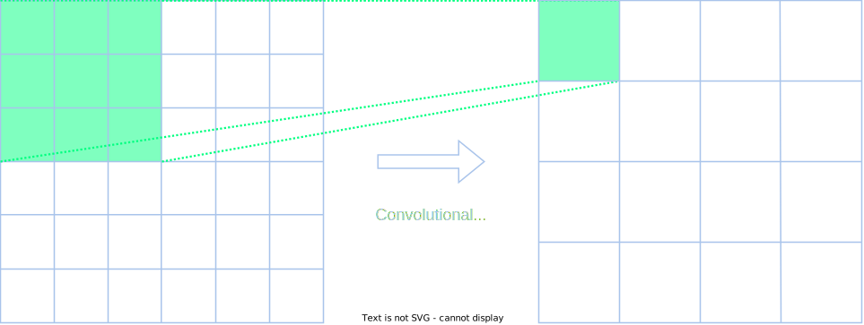
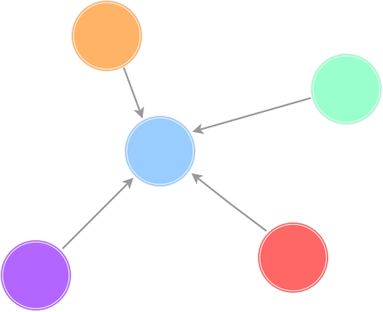
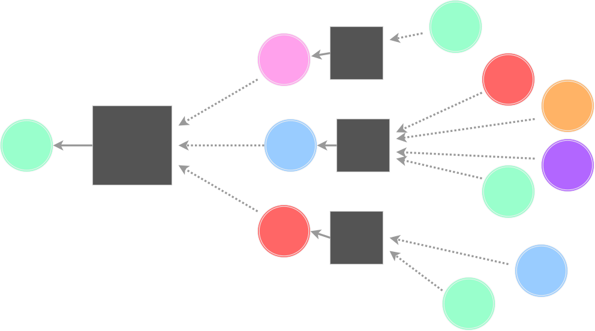
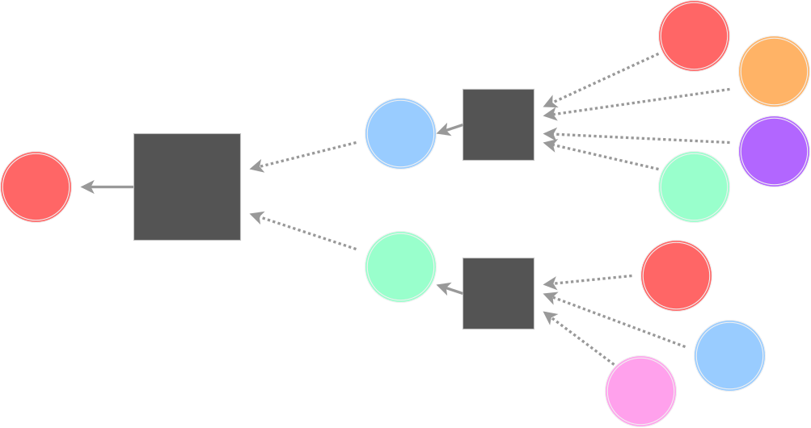
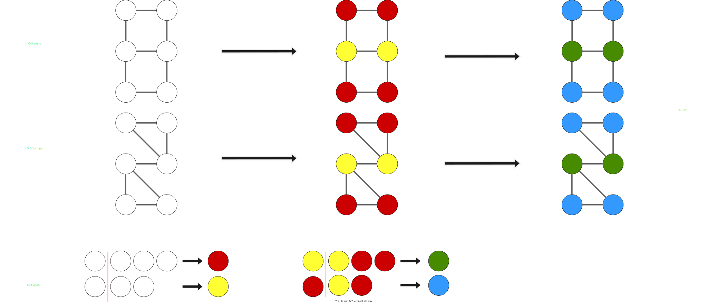

+++
title="The power of Graph Neural Networks"
date=2024-01-31

[taxonomies]
categories = ["Research summary"]
tags = ["graph", "graph neural network", "machine learning"]

[extra]
toc = true
+++

There is something about graph algorithms - they are just always fun to think about! With that said, Graph Neural Netorks (GNN) are no exception. These are a form of neural network, but designed in a way to learn things _about_ graphs. They have proven to be usefull for a plethora of graph learning problems, and can efficiently learn to estimate missing edges, vertex embeddings, and properties spannign the whole graph. In this post, I will present the difficulty of directly applying neural networks (NN) to graphs, how message passing NN solves this, and end by looking at the expressing power of such GNN.

<!-- more -->

# Background on Graphs

The mathematical notion of a graph is 
G = (V_G, E_G, L_G)
:
- A Vertex set

V_G

  - These are the named vertices (nodes) in the graph.
- An Edge set

E_G \subseteq V_G \times V_G

  - Each edge connects two vertices.
- Vertex labels

L_G : V_G \rightarrow \Sigma \in \R^d

  - Each vertex has a set of labels, which contain some extra information about what the node represents. This could for example be geographical coordinates if the graph represents a geographical map.

If you have not worked much with graphs, they might seem niche, but you later realize they are everywhere. Some examples of where graphs are used:
- To model social networks,
- Knowledge graphs are popular to build up a structured network of knowledge,
- Geographical maps,
- Modeling the 3D structure of proteins,
- Solving [fun programmaing puzzles](https://adventofcode.com/2023/day/17),
- And much more...

# Goal of Graph Learning

There are three main embeddings we want to learn when to comes to graph learning:
- Vertex embedding
  - Want to estimate some properties per node. For example the political party of a person on Facebook.
- Edge embedding
  - Want to learn some relations between nodes. In a chemical graph, we could use this to predict the strength of the bonds (edges) between atoms (vertices).
- Graph embedding
  - Here we want to learn a property about the whole graph in aggregate. When used in drug discovery, this could help predict the molecular properties of a drug (a graph).

Thes can be seen as the main embeddings we are usually interested in. However, as we will see later, in GNN we often mainly care about vertex embeddings which we in turn aggregate to the other embeddings if wanted.

# Applying Deep Learning to Graphs

Deep learning has recently proven to be extremely useful for a variety of machine learning tasks. Therefore, people have naturally been interesting in utilizing its power to learn things about large graphs.

## Common Ideas of Deep Learning

Before we begin with GNN, we should look at what basic building blocks used in Deep Learning (DL). Classic DL network are constructed as several layers, each with the following characteristics:
- First, we apply some form of linear transformation of the input (which can be modeled with a matrix multiplication of some sort). For example, this can be a fully connected layer in a NN, or a convolutional layer in a CNN.
  - This is nice to mix the inputs, and form connections. But, if we just combine a bunch of these, we could just represent the combination as a big matrix multiplication. We need something more.
- Secondly, there is some non-linear activation function. This is the key which gives the network its elevated expressive power compared to a linear transformation. Examples of this can be versions of Rectified Linear Units (ReLU), which basically apply `f(x) -> max(x, 0)` to all inputs.

## Naive Neural Networks

The simplest idea in DL is often to just throw neural networks at the problem, and one might want to simply throw a NN at a set of graphs to learn some hidden embedding for them (say we feed the adjacency matrix appended with node features as input). However, this quickly becomes problematic due to the complex nature of graphs. When learning things about text or images, we have a sequence or grid of inputs, which have very clear structures in comparison to the endless possibilities of graphs. Here are some concrete problematic points:
- **Variable size**: Different graphs will have different sizes. This is also a problem for images, but there the naive solution of cropping/resizing and padding them work rather well. However, how would one rezise a graph? Where would we add padding or crop nodes?
- **Complex topology**: This is sort of the underlying problem, but there is no set notion of locality or order in a graph. For example, there is no 'top left' or 'first' vertex, as there are in sequences of grids.
- **Input invariance**: This follows from the second point as there is no predefined order among the vertices. As most DL methods are dependent on the order of the input (eg. a classical NN), the order you pass the nodes becomes paramount. We desire a method where the order of the inputs have zero effect (the locaility will be based on edges instead of input position), but this is trickly with simple NN.

So, just throwing a neural network is not the way to go. Instead we need a method which can handle variably sized graphs, as well as handle the complex topology and invarianve over node order which is so inherent to graphs.

## Convolutional Neural Networks

We take inspiration from the idea of Convolutional Neural Networks (CNN), which are used extensively where the inputs are grids. The idea is that you convolve the input with some small kernel with learnable parameters (way less parameters than a fully connected layers). For 2D inputs, this can be seen as sliding this kernel (a small matrix) over the input grid, for each overlap pairwise multiplying overlapping values and then summing them together. This is done for all possible overlaps, and you get a transformed output. This is visualized below where we can see how a 3x3 kernel operates on a 3 by 3 area to find one output (then it slides to find the rest).

The core idea here is to utilize the spatial locality of adjacent cells to find some meaningfull embedding. We want to adapt this great idea to the much more complex topology to graphs!

### From Images to Graphs

So, a 3x3 kernel for each node (disregarding edges) essentially adds a weighted sum of the neighbors of every cell. We can do this in graphs as well, where we in a similar fashion would create an intermediate embedding where each node collects some weighted sum of their neighbors embeddings (as can be seen below). Then, we can pass that through a non-linear activation function in similar vein to normal CNN.

## Message Passing Neural Networks

Let's expand the idea from CNN we showed before, to create a Message Passing Neural Network (MPNN). Given the following graph

we can want to use the idea of aggregating neighbor embeddings as shown above. Furthermore, the algorithm should not just take the immediate neighbors into account, but also their neighbors, and their neighbors, and so on. This can be done by creating a custom computation network for each node. The following image depicts the computation graph for the green node above.

This compuation graph defines the computation of the vertex embedding of the green node, and can be seen as some Deep Learning Network. How you select the aggregations (gray boxes) is what defines the GNN architecture (but you must make sure they are order invariant). The basic approach for the _neighbor aggregation function_ is to first average all neighbor embeddings (linear), and then feed it through some neural network (nonlinear).

Furthermore, these computation graphs look different for each node, as they have different starting points. Here is the computation graph for the red node.

We see that it is different, but each aggregation for every node always looks exactly the same, only we have to stop showing the aggregations at some level for legibility.

The way this is computed is to think of this whole process as iterative. First, the nodes start out with the embedding as their input properties, then they all aggregate values from their neighbors to compute the first-level embedding. This is repeated for some finite number of steps where we decide the nth-level vertex embeddings are the final ones. Formalizing one such step, we get the following.


h_v^{(l)} = Upd^{(l)}\left( h_v^{(l-1)}, Agg^{(l)}( \{ h^{(l-1)}_u \forall u \in N_G(v) \} )\right)


Here _h_ is a vertex embedding and _Upd_ and _Agg_ are the update and aggregation functions (which contain learnable parameters). In the simplest case, _Agg_ can be a linear transformation where we sum all _u_, multiply the sum with a square (learnable) weight matrix (_W_), and add a bias vector (_b_). The _Upd_ can apply a similar transformation to the node itself, sum all of them together, and feed it through a non-linear activation function

\sigma
.


h_v^{(l)} = \sigma\left( W_1^{(l)}h_v^{(l-1)} + \Sigma_{u \in N_G(v)} W_2^{(l)}h^{(l-1)}_u  + b^{(l)}\right)


While this expresses the update function of a single vertex embedding, we can move it to matrix form to find the embeddings of all vertexes.


h^{(l)} = \sigma\left( W_1^{(l)}h^{(l-1)} + A W_2^{(l)}h^{(l-1)}  + B^{(l)}\right)


So

h^{(n)}

becomes the final embeddings, after iterating for some predetermined _n_ iterations (can think of them as layers in a classical NN).

### Graph embedding

To get the graph embedding from the final vertex embeddings, we simply apply a final aggregation (eg. average) to all vertices, and then feed it through some NN (for example a multilayer perceptron).

h_G = \rho(h^{(n)})


A similar method can be used to transform these vertex embeddings to edge embeddings (or more generally p-vertex embeddings for p connected nodes).

### Training the MPNN

We have now descibed how a Message Passing Graph Neural Network (MPNN) computes embeddings, given the learnable parameters/functions. But how do we actually train this network?

Well, it works basically the same as with a classical NN. In supervised learning (where we have labels on the training data) we define a loss function

\mathbb{L}(\textit{labels}, h^{(n)})

between the final embeddings and the given labels. This loss function could for example be the L2 norm (euclidean distance) if the labels are real nubmers, or the cross entropy if they are categorical. We then use methods such as Sthochastic Gradient Descent and back-progagation to uptade the learnable parameters after the loss function.

For unsupervised training we must work a bit extra as there are no training labels. Instead we strive for _similar_ vertexes to have _similar_ embeddings. Then we need some similarity metric, which could e.g. be calculated from a random walk experiment, a matric factorization, or graph proximity.

# Expressive power

How that we have looked at modern GNNs, especially MPNN, we should take a step back and answer: What are these networks capable of? What are their _expressive power_? Furthermore, what is _expressive power_, and how do we measure it?

## Notions of expressivity

To talk about expresssivity, we will define
- _H_ as the set of all possible learned networks,
- _G_ as the set of inspected graphs.

Then, for some embedding _E_, we say that
- _H_ can _G-express_ _E_, if there exists a network in _H_ such that that network gives the exact same embedding as _E_ on all graphs in _G_.
- _H_ can _G-approximate_ _E_ if for any

\epsilon > 0
,
there exists a network in _H_ such that the difference between the networks encoding and _E_ is smaller than

\epsilon

for all graphs in _G_.

These defitions describe what embeddings we can possibly express with a certain GNN architecture. But then there is the _distinguishing power_ of _H_, which concerns how many graphs the network can differentiate (with optimal values).
- The _distinguishing power_ of _H_ is the sef of pairs from

G \times G

such that the embedding of both graphs are equal.

Thus, a high distinguishing power (counting number in set) is _bad_ and means that the network cannot differentiate different graphs.

So far, the focus in the ML community has been on characterizing the distinguishing power of GNN, to hopefully shed some light on what graph properties a learning method can detect and use.

## Color Refinement

Before moving on to the jucy parts, we have to take a detour to the classical algorithm of _color refinement_. This is an algorithms to color a graph, and is often used as a good heuristic for if two graphs are isomorphic (identical).

Here is an overview of how the algorithm works:
- At the start of the algorithm, all nodes are identically colored.
- Repeatedly, identically colored vertices are separated into different colors based on color histograms of neighbors.
- Two graphs are not isomorphic if they have different color histograms.

This is simplest to show visually. Here are two graphs, which together goes through the iterations of the algorithm. After the second iteration, they contain different colors, so we can conclude they are not isomorphic!

However, if we apply the same algorithm to the following non-isomorphic graphs, the algorithm cannot guarantee that they are not isomorphic.

This means that the coloring cannot distinguish these last two graphs, meaning the pair is within the algorithms distinguishing power. For example it
- cannot distinguish d-regular graphs,
- cannot count cycles,
- can only capture tree information.

## Expressive power of MPNN

So what does this color refinement have to do with the expressive power of MPNN? Well, [Xu et al. 2019](https://dblp.org/rec/conf/iclr/XuHLJ19) and [Morris et al. 2019](https://dblp.org/rec/conf/aaai/0001RFHLRG19.html) both proved that
> If colour refinement cannot tell two graphs apart then neither can any MPNN!

Furthermore, [Morris et al. 2019](https://dblp.org/rec/conf/aaai/0001RFHLRG19.html) proved that the distinguishing powers are equal:
> There exists a GNN 101 which can embed G and H differently when colour refinement assigns them different colours.

This is bleak news for MPNN as extensive earlier research on color refinement has shown its severe limitations in expressive power. For example, as we said above, it can only capture information about tree-like dependencies, and cannot really capture cycles.

## Increasing the Expressive power of MPNN

There are different ways to approach the problem of limited expressive power of GNNs, and most of it seems like early DL (or alchemy), where you just try things and have faith.

### Idea: Feature engineering

One proposed improvement is the old school _feature engineering_, which Deep learning was supposed to eliminate. By adding features such as
- number of edges,
- number of cycles of a specific length,
- matches with certain patterns,
- other centrality measures,
our MPNN can boost their distinguishing power as they gain some information outside trees. However, this is a cheap trick, and only solves the problem for the certain patterns overlapping with your features. You can always combine such patterns in a way that the network cannot distinguish.

### Idea: Random vertex identifiers

One can note that two nodes with the same features (color in graph refinement) will be treated equally by MPNN. What if we add vertex identifiers to distinguish different nodes?

This is useful for cycle detection, and is equivalent to color refinement where every node starts with a unique color. A common way to choose these identifiers is at random, where we get the theorem
> rMPNNs(+) approximate any invariant graph/vertex embedding with high probability.

However, this feels very ugly, as we completely destroy one of the key features of GNN: invariance. However, as the labels are assigned randomly, and mainly matter to differentiate nodes, there are some averaging schemes which make this work rather well (some tradeoff between invariance, expressiveness, and complexity).

### Idea: Global information

This feels a bit like advanced feature engineering, and you can boost the expressiveness by extracting global graph information to use as positional encodings of vertices. For example, including the spectral information of the graph can give a large boost, and has been used in several papers from 2023.

# Conclusion

The idea of Graph Neural Networks feel very natural in todays world, where both graphs and NN are so prelevant. Even though MPNN are shown to have inherent limitation in their expressiveness, they seems to work relatively well in practice. It might be that distinguishing different inputs is not the most important factor for useful ML. Especially when you add some ideas such as incorporating spectral information it might be good enough.

I have only scrached the surface, and think it would be fun to learn more about different GNN. The simple MPNN with averaging and a perceptron layer was cool, but I wonder what new architectures are having success. Is is similar to normal NN?

# Further Reading

I learned about this topic from professor Floris Geerts, at the ACM Europe Summer School on Data Science 2024, where he mainly focused on the expressive power part (cut short in this post). This is where I took most of the information regarding the expressive power here. If you want to learn more about the expressive power of GNN, I suggest you go and look at [his website](https://fgeerts.github.io/) to find some of his talks and publications.

If you don't care much for the expressive power, and just want to learn more about the design of GNN, such as different MPNN architectures, and their uses, I recommend the course [CS224W](https://web.stanford.edu/class/cs224w/) from Stanford. All the lectures are available for free on youtube [here](https://youtube.com/playlist?list=PLoROMvodv4rPLKxIpqhjhPgdQy7imNkDn&si=5A-oAolQkq8DMry_). It seems to be an excellent course covering the foundations of GNN.

